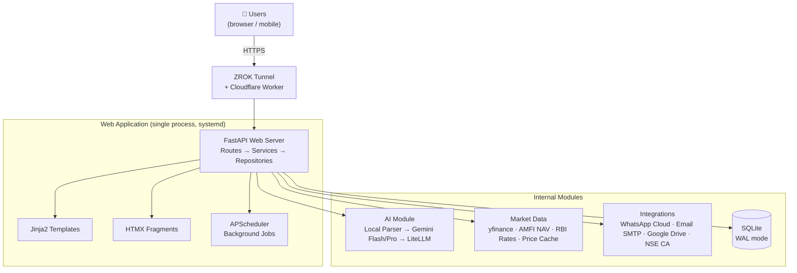
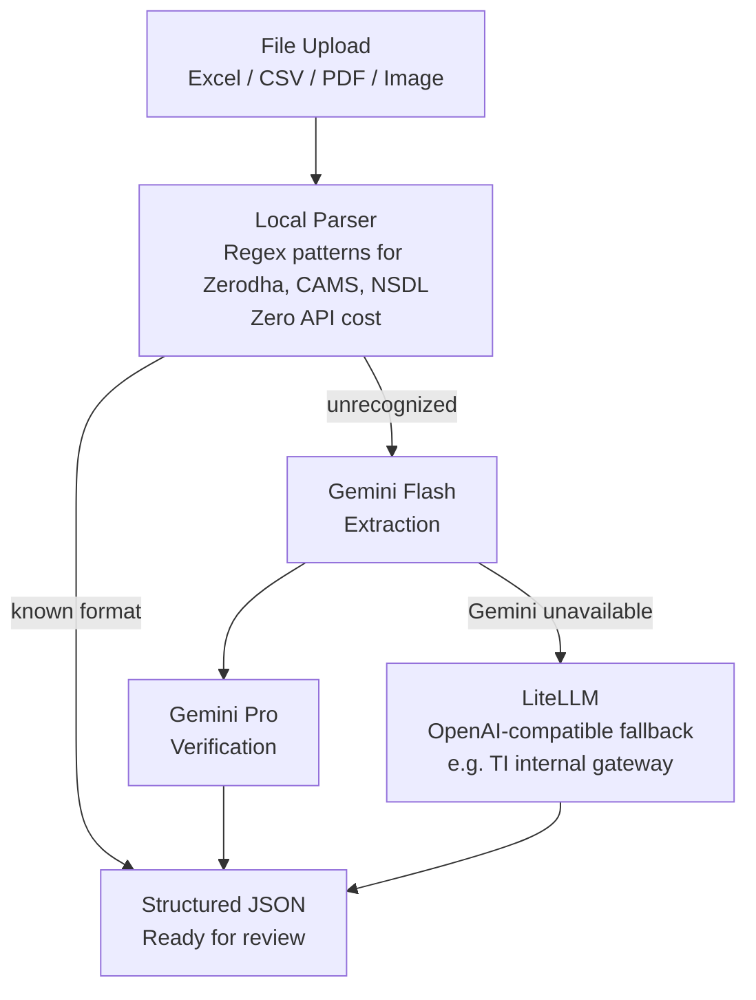
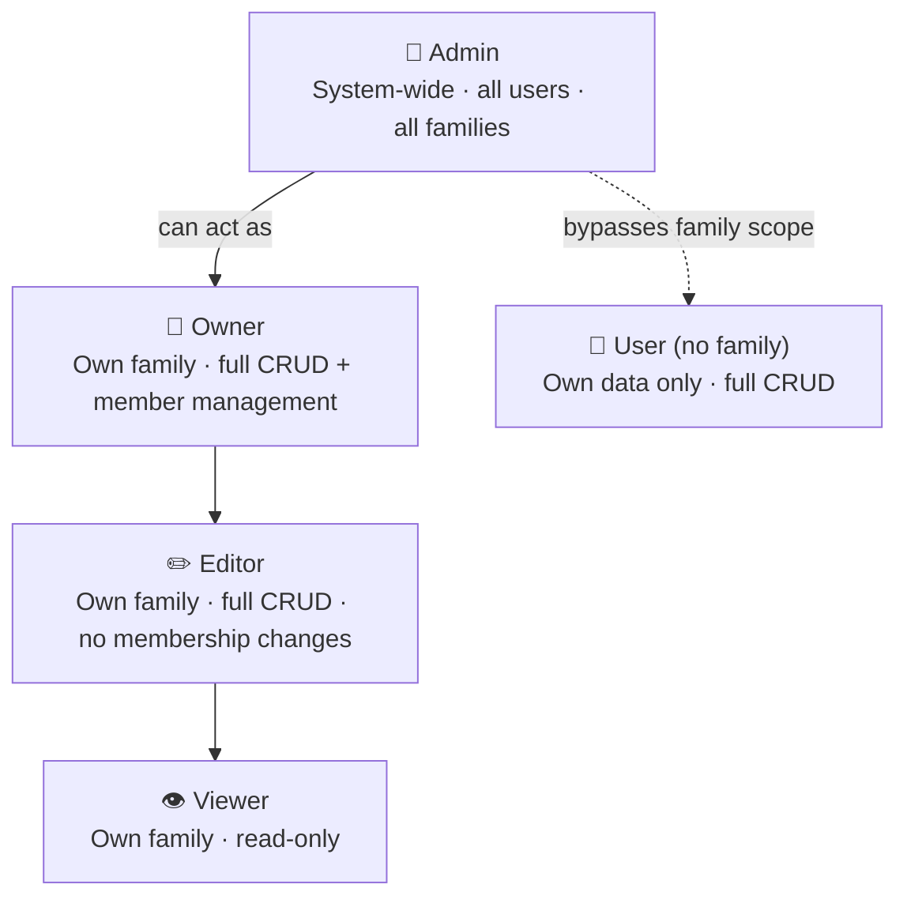
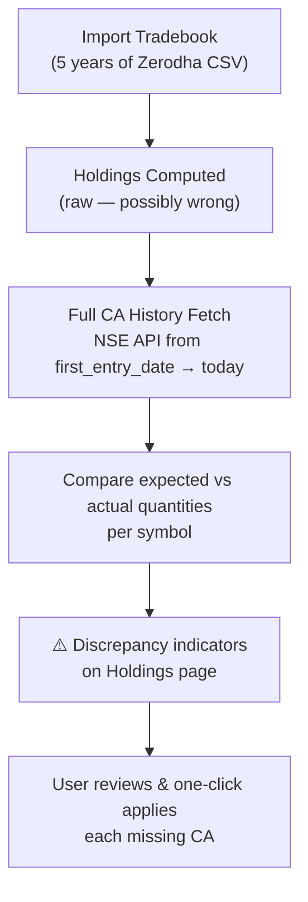

# NEESH — Never Ending Earnest Savings Hustle

**A self-hosted personal wealth management application for Indian families.**

---

## What Is NEESH?

NEESH consolidates investments, income, and financial data from across 11 asset classes and multiple brokers into one private, family-shared dashboard. It runs on a Raspberry Pi 4 (or any Linux host), serves up to 15 users across 5 families, and uses AI to parse broker statements.

**Core promise:** Answer the question *"What is my (and my family's) complete financial picture — right now?"* — without sending personal data to any third-party service beyond AI and market data API calls.

---

## System Architecture



---

## Feature Inventory (All Sprints)

| Sprint | Feature | Status |
|--------|---------|--------|
| 0 | Project setup, auth base, models, health check | Done |
| 1 | Registration (phone/name/DOB), WhatsApp OTP, JWT | Done |
| 2 | Transaction CRUD, holdings computation, tax classification | Done |
| 3 | Market data pipeline (yfinance, AMFI NAV, RBI rates) | Done |
| 4 | Dashboard with Chart.js, net worth, XIRR, snapshots | Done |
| 5 | AI Import Pipeline (local parser + Gemini + LiteLLM) | Done |
| 6 | Income Tracking (salary, dividends, auto-interest, TDS, recurring) | Done |
| 7 | Family Accounts (three-tier permissions, combined dashboard) | Done |
| 8 | Settings page, Zerodha Kite Connect OAuth, CSV fallback | Done |
| 9 | Admin Panel, audit logging, write access enforcement | Done |
| 10 | Remote Access (ZROK static URL + Cloudflare Worker) | Done |
| 11 | Email OTP Authentication (WhatsApp → Email → Console priority) | Done |
| 12 | Corporate Actions Auto-Detection (NSE daily sync, bonus/split) | Done |
| 13 | Demergers & Mergers (cost-basis splitting, merger swap ratios) | Done |
| 14 | Symbol Fetch Tracking & CA cleanup (daily sync optimization) | Done |
| 15 | Secure Backup (local + Google Drive + on-demand from admin) | Done |
| 16 | Historical CA Reconciliation (full NSE history, ⚠️ indicators) | Done |
| 17 | Holdings Baseline Check (Zerodha CSV vs NEESH, one-click fix) | Done |
| 18 | AI-Powered Holdings & Salary Import (Gemini vision for images) | In Progress |

---

## Asset Classes (11)

| # | Class | Key Characteristic |
|---|-------|--------------------|
| 1 | `direct_equity` | FIFO cost basis, ISIN tracking, CA-aware |
| 2 | `mutual_fund` | NAV-based, AMFI daily prices |
| 3 | `etf` | Exchange-traded, NSE/BSE prices |
| 4 | `fixed_deposit` | Auto-computed interest, TDS tracking |
| 5 | `sgb` | Semi-annual interest, maturity tracking |
| 6 | `rsu` | Vest date, perquisite tax, foreign currency |
| 7 | `esop` | Exercise price, grant/vest schedule |
| 8 | `espp` | Discount at purchase, foreign currency |
| 9 | `provident_fund` | EEE regime, manual balance entry |
| 10 | `bank_account` | Balance tracking, savings interest |
| 11 | `loan` | Liability tracking (UI deferred to Phase 2) |

---

## Working Principles

### 1. Everything Runs in One Process

No separate workers, no message queues, no Redis. The FastAPI app, APScheduler background jobs, and all integrations run in a single Python process managed by systemd. This keeps operational complexity near zero for a home server.

### 2. Server-Rendered Pages + HTMX for Interactivity

No React, no Vue, no Node.js build step. Jinja2 templates with HTMX for partial page updates. Tailwind CSS built on the dev machine and committed to git — the Pi has no Node.js. Chart.js for all charts.

### 3. SQLite Is Sufficient

WAL mode for concurrent reads. No database daemon. 50-60 year data retention target — SQLite supports up to 281 TB. Alembic for schema migrations. Weekly local + monthly Google Drive backup.

### 4. AI Providers Are Swappable

Three-layer AI pipeline. Services use `get_ai_provider(type)` — they don't import provider-specific code directly.



### 5. Corporate Actions Must Be User-Approved

The system auto-detects corporate actions (NSE daily sync) and flags them as pending. Users review and approve before application. No silent mutation of holdings. Consumed transactions are soft-marked (not deleted) so audit trail is preserved.

### 6. FIFO for Direct Equity

Direct equity cost basis uses First-In-First-Out (FIFO) processing. Each sell consumes the oldest lots. `total_invested` and `average_buy_price` reflect only remaining shares' cost, matching Zerodha's display.

### 7. Three-Tier Permission Model



Admin can bypass all family-level restrictions. All write operations are audit-logged.

### 8. Tax Classification Is Display-Only in Phase 1

Tax rates (STCG/LTCG/slab) are computed and shown but NEESH does not file taxes. Rates are configured per-asset-class so budget changes (e.g., Finance Act 2024 changes to equity LTCG rate) can be updated in one place without touching other code.

### 9. Historical Import With Corporate Action Reconciliation

When a user imports 5 years of Zerodha tradebook, holdings are silently wrong until corporate actions are applied. The reconciliation flow:



### 10. Remote Access Without Port Forwarding

ZROK provides a static share URL that tunnels to the Pi. When the Pi restarts and gets a new tunnel session, a Cloudflare Worker is notified with the new URL and updates its KV store. The landing page (`neesh.pages.dev`) fetches the current URL dynamically. Family members always access the same stable link.

---

## Code Organization

```
app/
├── models/           SQLAlchemy models (20 tables)
├── schemas/          Pydantic validation schemas
├── repositories/     Database CRUD layer
├── services/         Business logic
├── routes/           FastAPI route handlers
├── templates/        Jinja2 HTML + components
├── ai/               AI provider abstraction
│   ├── local_parser.py        Regex parser (Zerodha, CAMS, etc.)
│   ├── gemini_client.py       Google Gemini integration
│   ├── litellm_client.py      OpenAI-compatible endpoint
│   ├── llm_utils.py           robust_llm_call() — retry, JSON validation
│   └── prompts/               Extraction & verification prompts
├── market/           Market data (yfinance, AMFI, RBI, NSE CA)
├── integrations/     External services (WhatsApp, Email, Zerodha)
├── jobs/             APScheduler background jobs
└── config.py         All env vars and settings

tests/
├── unit/             Pytest unit tests
├── e2e/              Playwright browser tests
├── integration/      External API tests (yfinance, AMFI)
└── fixtures/         Broker statement samples (all 11 asset classes)
```

---

## Background Jobs

| Job | Schedule | Purpose |
|-----|----------|---------|
| Price refresh | Daily 3:45 PM IST | Update all held instruments from yfinance/AMFI |
| Corporate actions sync | Daily 6:00 AM IST | Fetch NSE CA data, match to user holdings |
| Symbol cleanup | Weekly | Mark closed positions inactive, prune stale CA rows |
| Weekly local backup | Weekly | Compressed SQLite snapshot with retention policy |
| Monthly Drive backup | Monthly | AES-256 encrypted backup to Google Drive |
| Recurring income | Daily | Generate scheduled salary/dividend/interest records |
| Recurring transactions | Daily | Generate scheduled SIP/RD/PPF transactions |

---

## Environment Setup

Three independent configurations:

| Environment | Database | Launch Script | Purpose |
|------------|----------|---------------|---------|
| Production | `data/neesh.db` | `start_user.bat` | Real personal data |
| Development | `data/neesh_dev.db` | `start_dev.bat` | Review E2E test output |
| Testing | `test_e2e.db` | `run_e2e_tests.bat` | Playwright E2E suite |

Dev mode login: Phone `9999999999`, Password `dev123`

---

## Key Design Decisions

| Decision | Choice | Reason |
|----------|--------|--------|
| Framework | FastAPI | Async, lightweight, server-rendered templates |
| Database | SQLite + WAL | No daemon, sufficient for ≤15 users, 50-yr longevity |
| AI | Gemini Flash/Pro + LiteLLM + Local Parser | Cost tiers, format diversity |
| Auth | WhatsApp Cloud API → Email SMTP → Console | Priority fallback, no single point of failure |
| Equity cost basis | FIFO | Matches Zerodha display, tax-correct |
| CA Application | User-approved, not automatic | Auditability, prevents silent data mutation |
| Hosting | Raspberry Pi 4 (4GB) | Self-hosted, always-on, home network |
| Remote Access | ZROK + Cloudflare Worker | Free, no port forwarding, stable landing URL |
| Backup | Local (weekly) + Google Drive (monthly) | Defense in depth for 50-year data |
