# NEESH — Never Ending Earnest Savings Hustle

### A self-hosted family wealth tracker built to last 50 years.

> *"What is my family's complete financial picture — across every investment, every platform, every currency — right now?"*

NEESH answers that question. It's a personal wealth management application I built for my family — consolidating 11 asset classes, multiple brokers, two currencies, and up to 5 families into a single private dashboard. No cloud dependencies for data storage. No subscription fees. Just a Python app running on whatever hardware you have at home.

---

## What's Inside

| Section | |
|:--------|:--|
| [Product Vision](#product-vision) | Why this exists and what it solves |
| [What It Tracks](#what-it-tracks) | 11 asset classes, income, tax classification |
| [How It Works](#how-it-works) | Architecture and transaction flows |
| [AI-Powered Import](#ai-powered-import) | Statement parsing with Gemini |
| [Family Accounts](#family-accounts) | Multi-user, role-based access |
| [Roadmap](#roadmap) | Phase 1 (done) → Phase 2 & 3 (planned) |
| [Technical Decisions](#technical-decisions) | Key architecture choices and why |
| [Development Learnings](#development-learnings) | What I learned building this |

---

## 🎯 Product Vision

Most Indian families have money scattered across a dozen platforms — mutual funds on Groww, stocks on Zerodha, FDs at three different banks, RSUs from work vesting in USD, a PF that nobody checks, and a home loan EMI that just... keeps going. Tax season arrives and everyone scrambles.

NEESH brings all of that into one place.

### Goals

| Goal | Target |
|------|--------|
| **Consolidation** | 11 asset classes, 3+ broker platforms, multi-currency |
| **Accuracy** | > 95% net worth match vs. manual calculation |
| **Timeliness** | < 1 hour price staleness during market hours |
| **Ease of Import** | < 5 minutes to upload and process a broker statement |
| **Family Coverage** | Up to 4 members per family, 5 families (15 users) |
| **Data Longevity** | Designed for 50–60 years of continuous use |

### Platform Support

Runs on anything that runs Python 3.11+:

- **Raspberry Pi 4** (4GB) — the original target. Always-on home server, ~₹5K.
- **BeagleBone Black** — similar ARM SBC, tested and working.
- **Any Linux box** — Ubuntu, Debian, Raspberry Pi OS. systemd service included.
- **Windows** — full support with batch scripts for dev/test workflows.

The entire stack — web server, background jobs, database — runs in a **single Python process**. No Docker. No Redis. No PostgreSQL daemon. Just SQLite in WAL mode and a FastAPI server.

### What's Live Today (Phase 1) — and What's Coming

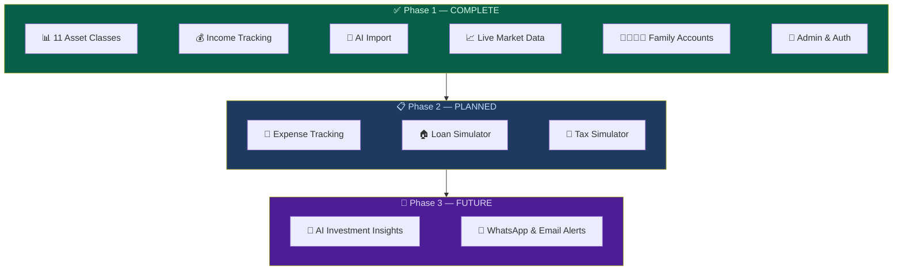

---

## 📦 What It Tracks

### 11 Asset Classes, Grouped by Behavior

The system handles five fundamentally different types of financial instruments. Each group shares a transaction model but has unique tax rules, valuation logic, and lifecycle patterns.

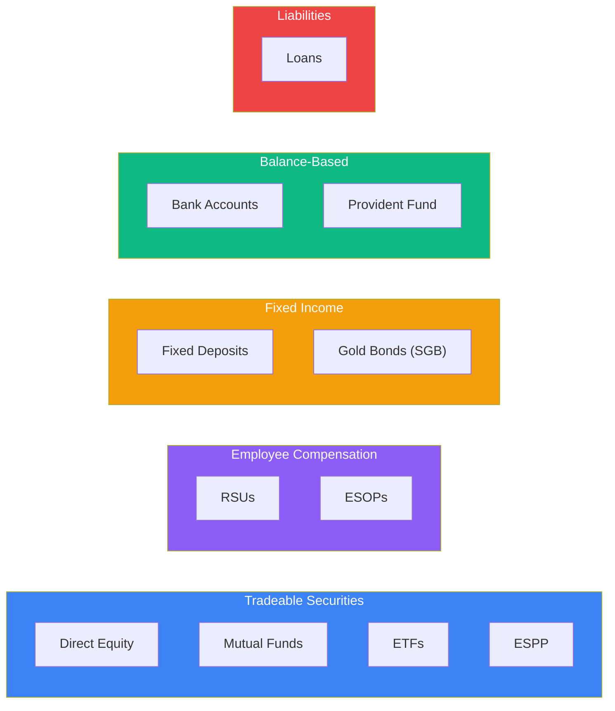

| Group | Asset Classes | Valuation Model | Key Complexity |
|:------|:-------------|:----------------|:---------------|
| **Tradeable** | Stocks, MF, ETF, ESPP | Qty × Market Price | FIFO lot tracking, live prices, multi-exchange |
| **Employee Stock** | RSU, ESOP | Vest/Exercise events | Perquisite tax, FX conversion, auto-creates equity on vest |
| **Fixed Income** | FD, SGB | Principal + Accrued Interest | Maturity lifecycle, penalty on early exit |
| **Balance-Based** | Bank, PF | Running balance | Fund flow linking, contribution tracking |
| **Liability** | Loans | Outstanding principal | Negative asset, EMI tracking |

### Multi-Currency & Tax Awareness

Every holding carries its tax classification — computed automatically from asset class rules and holding period. Foreign investments (RSUs, ESPPs, US stocks) track both foreign currency values and INR equivalents using RBI reference rates.

| Asset Class | STCG Threshold | LTCG Rate | Special Rules |
|:------------|:--------------|:----------|:--------------|
| Equity / MF / ETF | 12 months | 12.5% (above ₹1.25L exempt) | FIFO cost basis |
| Debt MF | 24 months | Slab rate | No indexation post-2023 |
| Fixed Deposit | N/A | Slab rate | Interest = income, TDS applicable |
| SGB | 12 months | 12.5% | **Tax-free on 8-year maturity** |
| RSU / ESOP / ESPP | 12 months from vest | 12.5% | Perquisite tax at vest/exercise |
| Provident Fund | N/A | **Exempt** | EEE regime |

### Income Tracking

Income isn't just salary. NEESH tracks every money inflow:
- **Manual entries** — salary, bonuses, freelance, rental
- **Auto-generated income** — dividends from equity holdings, interest from FDs, SGB coupon payments
- **TDS tracking** — tax deducted at source on FDs, dividends
- **Financial year views** — income summaries aligned to India's April–March FY

When a dividend transaction is recorded on a stock holding, the system automatically creates an income entry. No double entry.

---

## ⚙️ How It Works

### The Core Principle: Transactions Are the Source of Truth

Every financial event is recorded as a transaction. Holdings are never stored independently — they're always **computed** from the transaction history. This means:

- Edit a past transaction → holding automatically recomputes
- Delete a transaction → holding adjusts
- No data can ever be "out of sync"

The `holdings_summary` table is a **cache** — it can be dropped and rebuilt from scratch at any time.

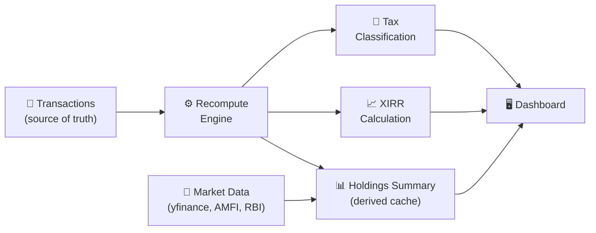

### System Architecture

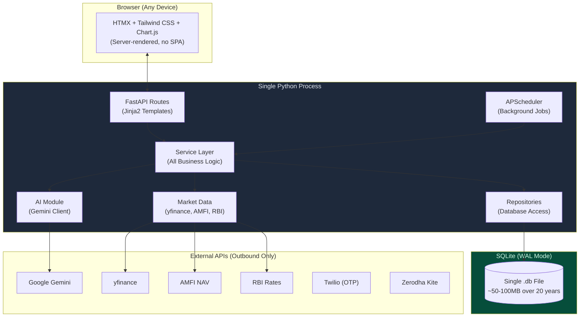

**Layered architecture** — every layer has one job:

| Layer | Responsibility | Rule |
|:------|:--------------|:-----|
| **Routes** | Accept requests, return HTML | No business logic. Ever. |
| **Services** | All computation, validation, orchestration | The only place logic lives |
| **Repositories** | Database reads and writes | No decisions, no calculations |
| **Templates** | Display data | No computation |

This strict separation means Phase 2/3 features can compose with existing services without refactoring.

---

> 👇 *Click any section below to expand the detailed flow diagrams.*

<h3>Transaction Flow — Tradeable Securities (Stocks, MF, ETF)</h3>

The most common flow. Covers buying, selling, corporate actions, and automatic holding recomputation.

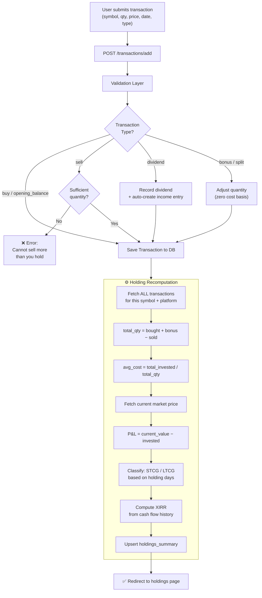

Mutual funds use AMFI scheme codes for NAV lookup. ETFs and stocks use yfinance. The recomputation engine is the same for all three — only the price source differs.

---

<h3>RSU Vest → Auto-Creates Direct Equity</h3>

When RSU shares vest, the system automatically creates a corresponding `direct_equity` BUY transaction. This avoids double-entry and ensures vested shares appear in the equity portfolio with the correct cost basis (fair market value at vest, converted to INR).

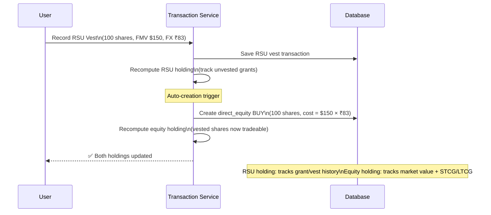

**Tax implications captured:**
- **At vest:** Perquisite tax = (FMV − $0) × quantity × FX rate → taxed as salary income
- **At sale:** Capital gains computed from vest-date FMV (not $0), with holding period starting from vest date

---

<h3>Fixed Deposit Lifecycle</h3>

FDs follow a state machine — they're opened, accrue interest daily, and close via maturity or premature withdrawal.

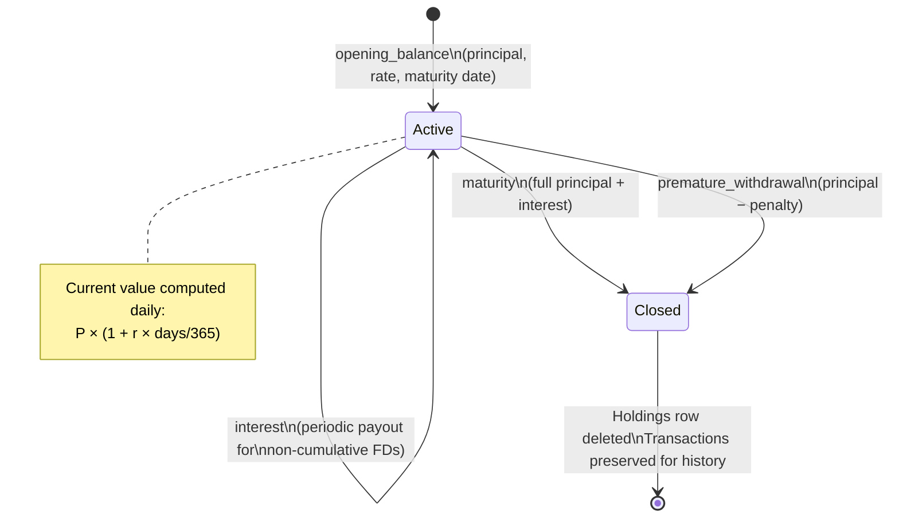

On maturity or premature withdrawal, the holdings row is **deleted** (the FD no longer exists as a holding), but all transactions remain for historical record and tax computation.

---

<h3>Bank Account Fund Flow</h3>

Bank accounts track running balances and link to investment transactions — when you buy stocks, the money has to come from somewhere.

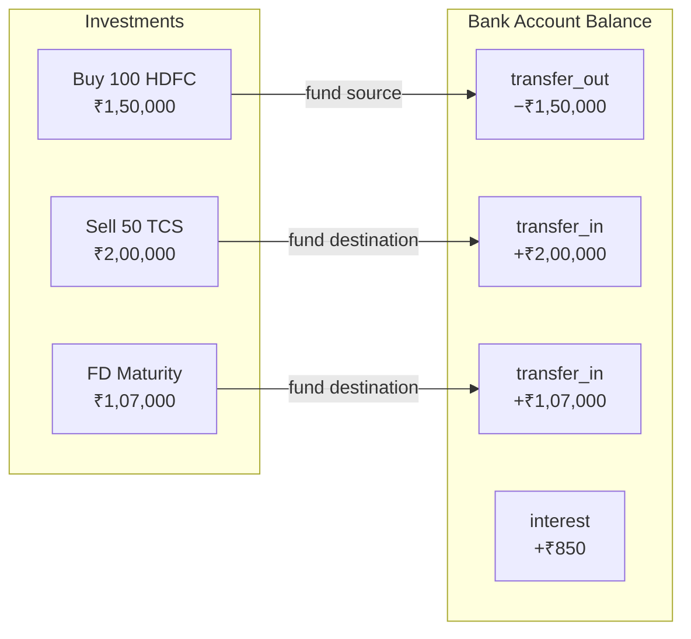

Balance computation:
- If a `balance_update` transaction exists → use it directly (from bank statement)
- Otherwise → accumulate: `opening_balance + transfers_in − transfers_out + interest`

---

<h3>Holding Recomputation Engine</h3>

This is the heart of the system. Runs after every transaction create/edit/delete.

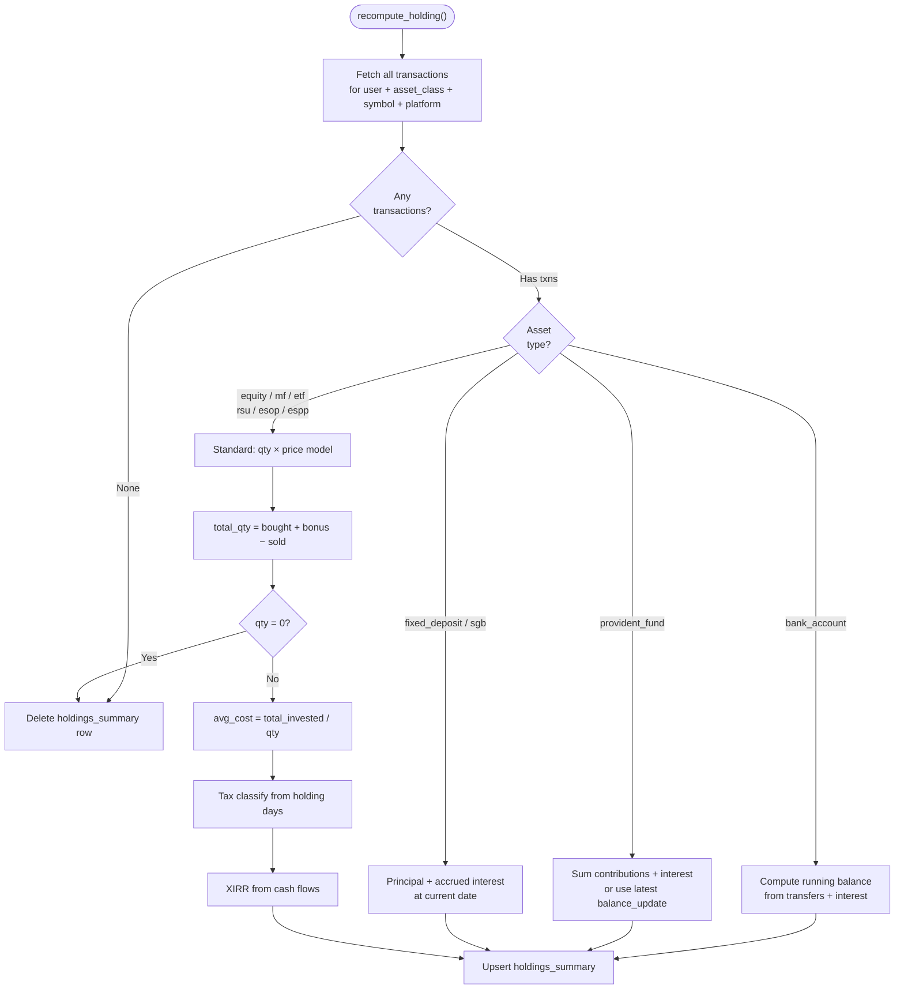

XIRR is computed using `pyxirr` (Rust-based, 100× faster than scipy). Returns annualized return accounting for irregular cash flow timing — critical for SIP investments where money goes in monthly.

---

## 🤖 AI-Powered Import

Manually entering every transaction is a non-starter when you have years of investment history. NEESH uses a **three-tier parsing pipeline** to extract transactions from broker statements.

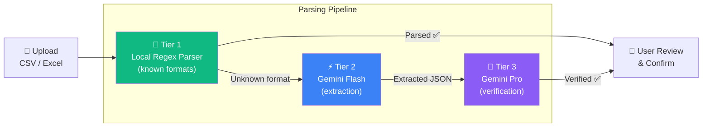

| Tier | Engine | Purpose | Speed |
|:-----|:-------|:--------|:------|
| **Tier 1** | Regex parser | Known formats (Zerodha, CAMS, NSDL) | Instant |
| **Tier 2** | Gemini Flash | Extract structured data from unknown formats | ~2-3 sec |
| **Tier 3** | Gemini Pro | Re-verify extracted data for accuracy | ~5 sec |

**Why two AI models?** Flash is fast and great at structured extraction. Pro is slower but catches reasoning errors — wrong date formats, misidentified transaction types, currency confusion. The verification step catches ~15% of extraction errors.

Files are parsed locally first (openpyxl/csv) and sent as text to Gemini — never as binary files. This avoids Gemini's File API quotas and works reliably.

---

## 👨‍👩‍👧‍👦 Family Accounts

NEESH is designed for families, not just individuals. A family of four can each have their own portfolio while seeing a combined family dashboard.

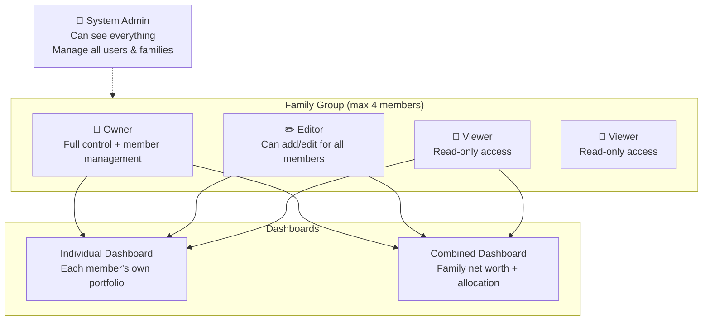

### Three-Tier Permission Model

| Role | Own Data | Family Members' Data | Family Settings |
|:-----|:---------|:--------------------|:---------------|
| **Owner** | Full CRUD | Full CRUD | Add/remove members, manage roles |
| **Editor** | Full CRUD | Full CRUD | View only |
| **Viewer** | View only | View only | View only |

The **Admin** role sits above families — system-wide access for user management, audit logs, and troubleshooting. First registered user is auto-assigned Admin.

---

## 🗺️ Roadmap

### Phase 1 — Complete ✅

Delivered across 10 sprints:

| Sprint | Deliverable |
|:-------|:-----------|
| Sprint 0 | Project bootstrap — models, auth, database, health checks |
| Sprint 1 | Authentication — WhatsApp OTP, JWT tokens, dev mode login |
| Sprint 2 | Transactions — CRUD for all 11 asset classes, holdings computation |
| Sprint 3 | Market Data — yfinance integration, AMFI NAV, RBI rates, price caching |
| Sprint 4 | Dashboard — net worth charts, asset allocation, P&L visualization |
| Sprint 5 | AI Import — local parser + Gemini Flash/Pro pipeline |
| Sprint 6 | Income Tracking — manual entry, auto-income from dividends/interest, TDS |
| Sprint 7 | Family Accounts — groups, permissions, combined dashboards |
| Sprint 8 | Zerodha Integration — OAuth flow, portfolio sync (planned) |
| Sprint 9 | Admin Panel — user management, audit logging, write access controls |

### Phase 2 — Planned

Three independent modules that extend Phase 1 without restructuring it.

> 👇 *Click to expand each module's details.*

<b>Phase 2A — Expense Tracking</b>

Syncs expense data from a user-maintained Google Sheet (no OAuth — just a public CSV export URL). Weekly background job pulls new rows, deduplicates, and stores in SQLite.

**Dashboard gets:** monthly expense summary, category breakdown, savings rate (income − expenses).

**Key design:** Expenses and income remain separate tables. Net savings is computed, never stored. Family-linked sheets aggregate into the family dashboard.

<b>Phase 2B — Loan Simulation Engine</b>

The `loans` table exists in Phase 1 but the UI is deferred. Phase 2 implements the full loan module **plus** a simulation engine.

Users can model:
- Extra EMI payments (which months)
- EMI step-up strategies (annual % increase)
- Lump-sum prepayments (reduce tenure or reduce EMI)

Output: original vs. optimized tenure, total interest saved, full month-by-month amortization schedule. Pure computation — no external APIs.

**Architecture note:** Phase 1 stores prepayment/rate history as JSON columns. Phase 2 migrates these to proper normalized tables via Alembic — planned from day one.

<b>Phase 2C — Tax Simulation</b>

Extends Phase 1's display-only tax classification into interactive "what-if" scenarios:

- *"If I sell TCS today, what's my tax?"*
- *"Which losing investments should I sell to offset gains?"* (tax harvesting)
- *"What's my total capital gains tax this FY?"*

**The hook was built in Phase 1:** every asset class handler accepts an `as_of_date` parameter. Phase 1 defaults it to today. Phase 2 passes future dates. That's the entire integration point — no refactoring needed.

For RSU/ESOP/ESPP: DTAA computation showing tax liability under both Indian and US jurisdictions.

### Phase 3 — Future

<b>AI Investment Planning Assistant</b>

The most ambitious module. Uses Google Gemini Pro to analyze holdings against user-defined investment strategies.

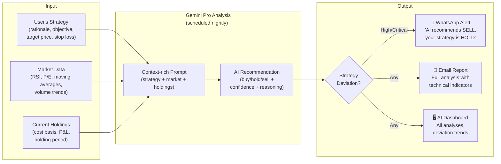

**Deviation detection:** If you said "long-term hold" but the AI recommends "sell" → HIGH deviation → WhatsApp alert. If you said "short-term trade" but the AI says "hold" → MEDIUM deviation → email report.

**Scale consideration:** 15 users × ~20 holdings = ~300 analyses. Gemini Pro at 2 RPM = ~2.5 hours. Scheduled at 2 AM.

Reuses existing infrastructure:
- Gemini client (same module, different prompts)
- Twilio (same credentials, WhatsApp notifications instead of OTP)
- yfinance (extended with `get_technical_indicators()`)

---

## 🏗️ Technical Decisions

> 👇 *Click to expand the reasoning behind each decision.*

<b>Why SQLite for a 50-year application?</b>

SQLite is the most deployed database in the world. It's not going away. A single `.db` file is trivially backed up, moved, and restored. Over 20 years, our data might reach ~100MB — SQLite supports up to 281 TB.

WAL (Write-Ahead Logging) mode gives concurrent reads while writes happen one at a time. With 2-3 simultaneous users and infrequent writes, this is never a bottleneck.

Weekly backups with SHA-256 checksums. Schema evolution through Alembic migrations — versioned, auditable, reversible.

<b>Why server-rendered HTML (HTMX) instead of React/Vue?</b>

This runs on a Raspberry Pi. No room for a Node.js build pipeline, 200MB of `node_modules`, or a separate frontend server.

HTMX gives us dynamic interactions (partial page updates, inline editing, async form submissions) with zero JavaScript framework overhead. Tailwind CSS handles styling. Chart.js handles charts. The browser gets plain HTML — fast to render, fast to load.

<b>Why single process (no Celery, no Redis)?</b>

Our "background job" load is: refresh prices once a day, refresh forex rates once a day, take a net worth snapshot, and check a weekly backup. That's 3-4 jobs per day.

APScheduler's `AsyncIOScheduler` runs inside the same event loop as FastAPI. Jobs are async functions — they don't block web requests. If the process crashes, systemd restarts it. No message broker, no worker process, no extra 200-300MB of RAM.

<b>Why FIFO for cost basis?</b>

Indian tax law uses FIFO (First In, First Out) for equity capital gains. When you sell shares, the oldest lots are sold first. This determines whether a sale is STCG or LTCG.

The system stores every buy transaction as a separate lot with its own date and price. On sell, it matches against the oldest lots first, computing gains per-lot with the correct holding period.

<b>Why two Gemini models (Flash + Pro)?</b>

Extraction is a different task than verification. Flash is fast (15 RPM free tier) and great at pulling structured data from messy text. Pro is slow (2 RPM) but catches reasoning errors.

In testing, the Pro verification step flagged ~15% of extraction errors — wrong transaction types, inverted buy/sell amounts, misidentified currencies. The two-model pipeline costs nothing (free tier) and significantly improves accuracy.

<b>Cross-phase architectural invariants</b>

Eight rules that every phase must follow:

1. **Transactions are the source of truth.** Holdings are always derivable from transactions.
2. **Every asset class handler implements the full interface**, including `as_of_date` for future tax simulation.
3. **Tax rules are configuration, not code.** Rates are class-level constants, not buried in if/else.
4. **Business logic lives only in the service layer.** Routes don't compute. Repositories don't decide.
5. **External clients have no business logic.** Gemini, Twilio, yfinance are generic wrappers.
6. **All schema changes go through Alembic.** No manual `ALTER TABLE`.
7. **JSON columns are for display-only data.** Anything queryable gets a proper column.
8. **`holdings_summary` is a rebuildable cache.** Drop it, recompute from transactions, lose nothing.

These constraints exist because Phase 2 and 3 need to compose with Phase 1 services. If business logic leaks into routes or templates, new features can't reuse it.

---

## 📊 Data Model Overview

The database has 15+ tables, but the core data flow is simple:

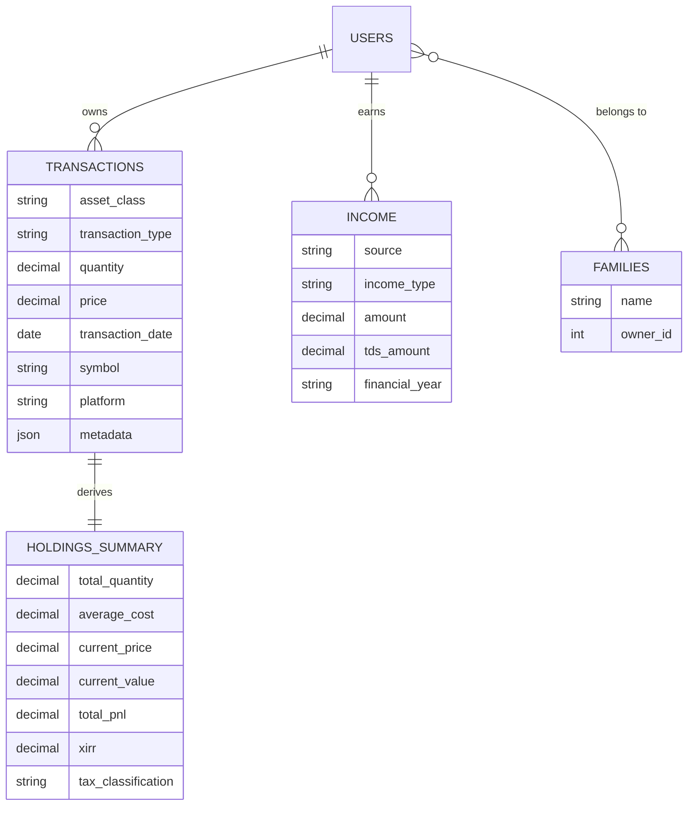

**Key design choices:**
- `metadata` JSON column stores asset-specific fields (FD interest rate, RSU grant date, loan EMI details) — keeps the transaction table universal without 50 nullable columns
- `holdings_summary` is denormalized for dashboard speed — but fully rebuildable
- Income entries can be auto-created from dividend/interest transactions — single source, no duplication

---

## 📐 Asset Class Handler Pattern

Every asset class implements a common interface. This is what makes the system extensible — adding a new asset class means implementing one handler, not touching the core engine.

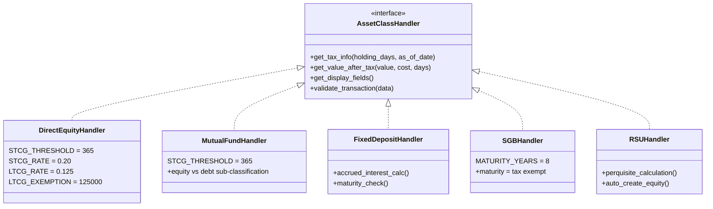

Tax rates and thresholds are **class-level constants**, not embedded in logic. When the Indian budget changes LTCG rates, it's a one-line config update per handler — not a code refactor.

The `as_of_date` parameter on `get_tax_info()` is Phase 1 code that exists solely for Phase 2's tax simulation. Today it defaults to `date.today()`. Phase 2 will pass future dates to compute hypothetical tax scenarios.

---

## 📖 Development Learnings

Building a 50-year financial application as a non-developer using AI tools taught me as much about planning and communication as it did about architecture and testing.

The full story is documented separately: **[Development Learnings — Building a Personal Wealth Manager with AI](neesh_development_learnings.md)**

Highlights:

- **Planning before prompting** — the four-step process (brainstorm → prioritise → categorise → user journeys) that turned a vague idea into a buildable spec
- **Transactions as source of truth** eliminates an entire class of data consistency bugs across 11 asset classes
- **Phase-aware architecture** — embedding hooks for Phase 2/3 (like `as_of_date` on every tax handler) without building the features
- **Three-tier AI parsing** (local regex → Gemini Flash → Gemini Pro) — same "right model for the right task" principle applied at the product level
- **The feedback discipline** — structured, specific, small-batch feedback is more effective than lengthy bug lists
- **Context window as a design constraint** — documents as source of truth, not conversations
- **Test isolation** with separate databases, ports, and cleanup scripts prevented hours of debugging
- **Git after every sprint** — non-negotiable when an AI agent is writing code at speed

---

## 📸 Screenshots

*Coming soon — screenshots of the dashboard, holdings view, transaction flows, and AI import pipeline.*

---

## 📚 Glossary

| Term | What It Is | What It Does in NEESH |
|:-----|:-----------|:---------------------|
| **SQLite** | A file-based relational database — no separate server process needed. The entire database is a single `.db` file. | Stores all transactions, holdings, income, user data. Trivially backed up by copying one file. |
| **WAL (Write-Ahead Logging)** | A mode for SQLite where writes go to a separate log file first, so readers aren't blocked. | Allows multiple family members to view dashboards simultaneously while one person is saving a transaction. |
| **FastAPI** | A modern Python web framework with built-in async support and automatic API documentation. | Serves all web pages, handles form submissions, processes API requests. Runs the entire backend. |
| **HTMX** | A small JavaScript library that lets HTML elements make HTTP requests and swap page content — no full-page reloads needed. | Powers dynamic interactions (search dropdowns, inline edits, partial page updates) without a React/Vue frontend. |
| **Tailwind CSS** | A utility-first CSS framework where you style elements with small class names (`bg-blue-500`, `text-lg`) instead of writing custom CSS. | Handles all UI styling including dark mode and responsive layouts. |
| **Jinja2** | A Python templating engine that turns HTML templates with placeholders into final HTML pages on the server. | Renders every page — dashboards, forms, tables — by injecting data from the service layer into HTML templates. |
| **JWT (JSON Web Token)** | A compact, signed token issued after login. The browser sends it with every request to prove identity. | Two tokens: a short-lived access token (30 min) and a long-lived refresh token (30 days). Users stay logged in without re-entering OTP daily. |
| **OTP (One-Time Password)** | A 6-digit code sent via WhatsApp for login. Valid for a few minutes, single use. | Primary authentication method — no passwords to remember or leak. |
| **Alembic** | A database migration tool for SQLAlchemy. Each schema change is a numbered script that can be applied or rolled back. | Manages all database structure changes across app versions. Critical for a 50-year data lifespan. |
| **SQLAlchemy** | A Python ORM (Object-Relational Mapper) that lets you work with database tables as Python objects instead of raw SQL. | Defines all data models (User, Transaction, Holding) and handles async database queries. |
| **APScheduler** | A Python library for scheduling background tasks (like cron jobs) inside your application process. | Runs daily price refresh, forex rate updates, net worth snapshots, and weekly backups — all without a separate worker process. |
| **XIRR** | Extended Internal Rate of Return — a financial metric that computes annualized returns accounting for irregular cash flow timing. | Calculates true investment returns for SIPs, partial buys/sells, and multi-date investments. Computed using `pyxirr` (Rust-based, very fast). |
| **FIFO (First In, First Out)** | A cost basis method where the oldest purchase lots are matched first when selling. | Required by Indian tax law for equity. Determines whether each sold lot is STCG or LTCG based on when it was originally bought. |
| **STCG / LTCG** | Short-Term and Long-Term Capital Gains — Indian tax categories based on how long you held an investment before selling. | Auto-classified per holding using asset-class-specific thresholds (e.g., 12 months for equity, 24 months for debt). |
| **TDS (Tax Deducted at Source)** | Tax pre-deducted by banks/brokers on interest and dividends before paying you. | Tracked per income entry so users know how much tax is already paid vs. still owed. |
| **DTAA (Double Tax Avoidance Agreement)** | A treaty between countries (e.g., India-US) to prevent the same income from being taxed twice. | Used for RSU/ESOP/ESPP — foreign tax paid in the US can be credited against Indian tax liability. |
| **NAV (Net Asset Value)** | The per-unit price of a mutual fund, published daily by the fund house. | Fetched from AMFI's public API to value mutual fund holdings. |
| **AMFI** | Association of Mutual Funds in India — maintains a public database of all mutual fund NAVs and scheme codes. | Primary data source for mutual fund prices and fund search/lookup. |
| **yfinance** | A Python library that fetches stock/ETF prices, historical data, and metadata from Yahoo Finance. | Provides live and historical prices for stocks, ETFs, and SGBs (via gold price). |
| **Gemini (Flash / Pro)** | Google's AI models. Flash is fast and good at structured extraction. Pro is slower but better at reasoning and verification. | Flash extracts transaction data from uploaded statements. Pro re-verifies the extraction for accuracy. Both on free tier. |
| **Twilio** | A cloud communications API for sending SMS, WhatsApp messages, and making calls. | Sends OTP codes via WhatsApp for login. Phase 3 will reuse it for investment alert notifications. |
| **systemd** | Linux's service manager — starts, stops, and auto-restarts background processes. | Runs the NEESH server as a system service that starts on boot and auto-restarts on crash. |
| **Cloudflare Tunnel** | A secure tunnel that exposes a local server to the internet via Cloudflare's network — no port forwarding or static IP needed. | Enables accessing NEESH from outside the home network over HTTPS. |
| **Upsert** | A database operation: insert a row if it doesn't exist, or update it if it does. | Used for `holdings_summary` — after recomputation, the holding row is created or updated in one atomic operation. |
| **EEE (Exempt-Exempt-Exempt)** | An Indian tax regime where contributions, growth, and withdrawals are all tax-free. | Applies to Provident Fund — no tax at any stage (within limits). |

---

Built with FastAPI, SQLite, HTMX, Tailwind CSS, Google Gemini, and a lot of family financial spreadsheets that needed to be consolidated.
