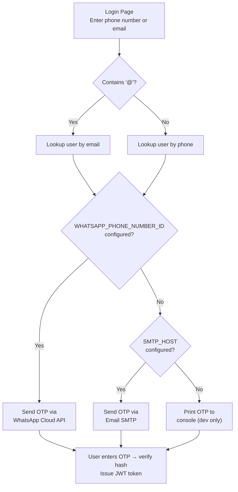
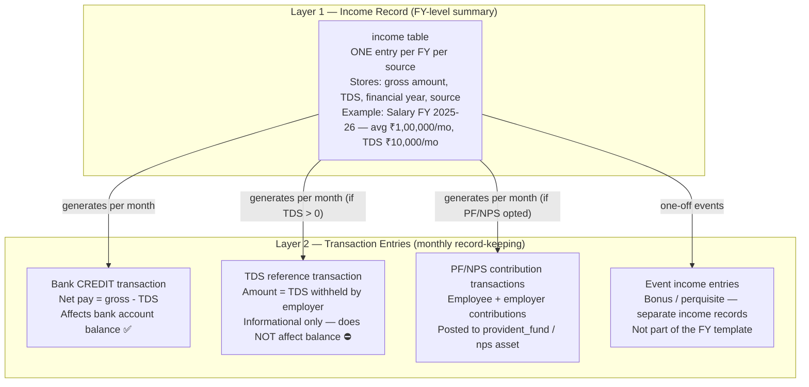
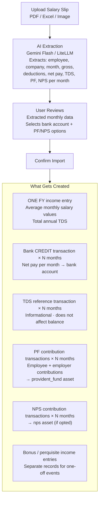
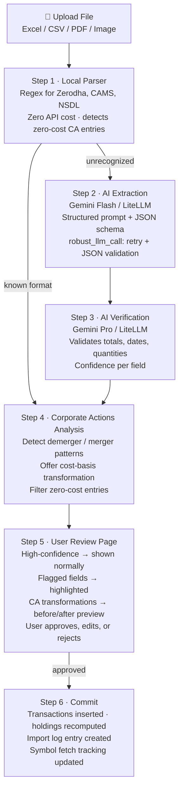
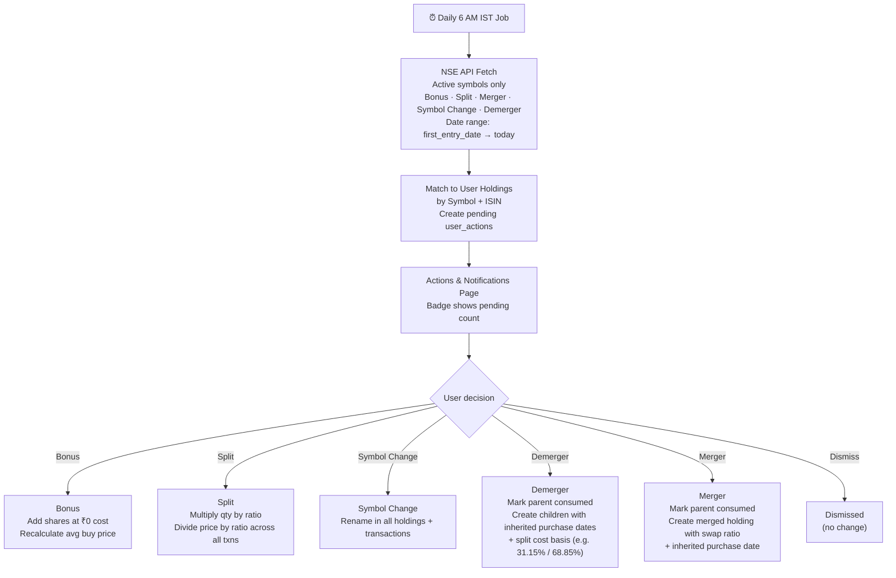
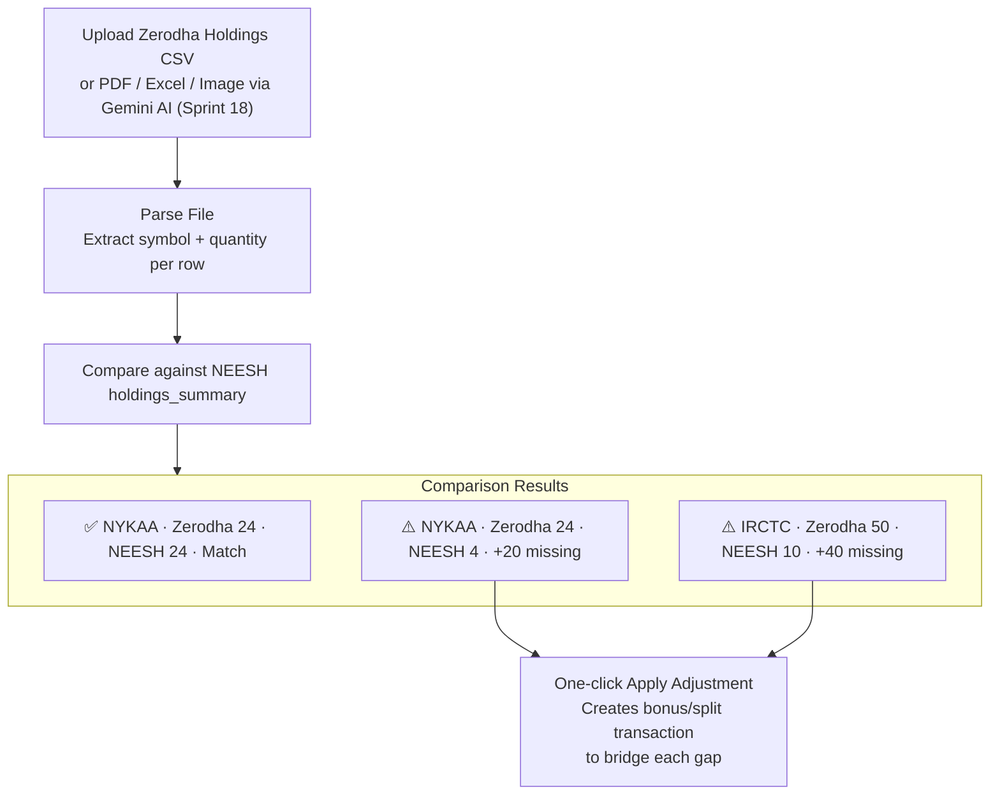
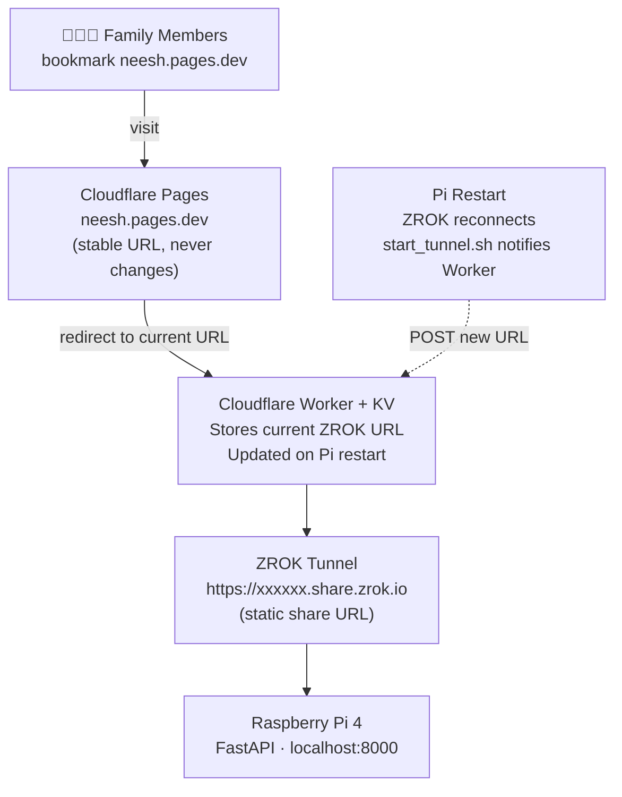

# 📄 Product Requirement Document (PRD)

## NEESH — Personal Wealth Management Application

**Version:** 1.0
**Date:** 2026-03-07
**Author:** Product & Engineering
**Status:** Draft

---

## Table of Contents

1. [Executive Summary](#1-executive-summary)
2. [Product Vision & Goals](#2-product-vision--goals)
3. [Project Phases](#3-project-phases)
4. [Users & Access Model](#4-users--access-model)
5. [Technical Architecture](#5-technical-architecture)
6. [Phase 1A — Investment Tracker](#6-phase-1a--investment-tracker)
7. [Phase 1A — Income Tracker](#7-phase-1a--income-tracker)
8. [Phase 1A — AI-Powered Data Import](#8-phase-1a--ai-powered-data-import)
9. [Phase 1A — Market Data & Price Engine](#9-phase-1a--market-data--price-engine)
10. [Phase 1A — Dashboard & Visualization](#10-phase-1a--dashboard--visualization)
11. [Phase 1A — Holdings & Transaction Management](#11-phase-1a--holdings--transaction-management)
12. [Phase 1A — Family Accounts](#12-phase-1a--family-accounts)
12a. [Phase 1A — Admin Panel & Permission Enforcement](#12a-phase-1a--admin-panel--permission-enforcement)
12b. [Phase 1A — Corporate Actions System](#12b-phase-1a--corporate-actions-system)
12c. [Phase 1A — Holdings Baseline Check](#12c-phase-1a--holdings-baseline-check)
13. [Phase 1B — Remote Access via ZROK & Cloudflare Worker](#13-phase-1b--remote-access-via-zrok--cloudflare-worker)
14. [Phase 2 — Expense Tracker](#14-phase-2--expense-tracker)
15. [Phase 2 — Loan Simulation Engine](#15-phase-2--loan-simulation-engine)
16. [Phase 2 — Tax Simulation Engine](#16-phase-2--tax-simulation-engine)
17. [Phase 3 — AI Investment Planning Assistant](#17-phase-3--ai-investment-planning-assistant)
18. [Database Design Principles](#18-database-design-principles)
19. [Asset Class Base Design](#19-asset-class-base-design)
20. [Non-Functional Requirements](#20-non-functional-requirements)
21. [Risks & Mitigations](#21-risks--mitigations)
22. [Appendix](#22-appendix)

---

## 1. Executive Summary

NEESH is a self-hosted personal wealth management web application designed to consolidate all investments, income streams, and (in later phases) expenses across multiple financial platforms into a single unified dashboard. The application runs on a Raspberry Pi 4 (4GB RAM) and serves up to 15 users across 5 families.

The system uses a layered AI pipeline (local regex parser → Google Gemini Flash/Pro → LiteLLM fallback) to parse account statements from various brokers, tracks live market prices, handles multi-currency foreign investments with proper tax classification, automatically detects corporate actions (bonus/split/demerger/merger) via daily NSE sync, and provides a consolidated net worth view at both individual and family levels.

**Key Differentiators:**
- Completely self-hosted — no data leaves the user's home network (except for API calls to market data and AI services)
- AI-powered statement parsing eliminates manual data entry for bulk imports (supports Excel, CSV, PDF, and images via Gemini vision)
- Unified view across 11 asset classes, multiple brokers, and multiple currencies
- Family-level aggregation with shared visibility
- Corporate actions auto-detection: bonus, split, symbol change, demerger, and merger detected from NSE and applied with user approval
- FIFO cost basis for direct equity, matching Zerodha's holdings display
- Designed with a common base asset class architecture for easy extensibility and future tax simulation

---

## 2. Product Vision & Goals

### Vision
A single, private, self-hosted application that answers the question: **"What is my (and my family's) complete financial picture — across every investment, every platform, every currency — right now?"**

### Goals

| Goal | Metric | Target |
|------|--------|--------|
| **Consolidation** | Number of platforms/asset classes unified | All 11 asset classes, 3+ broker platforms |
| **Accuracy** | Net worth accuracy vs. manual calculation | > 95% match |
| **Timeliness** | Price data staleness | < 1 hour for traded assets during market hours |
| **Ease of Use** | Time to upload and process a new statement | < 5 minutes end-to-end |
| **Family Coverage** | Family members with linked portfolios | Up to 4 per family, 5 families |
| **Data Longevity** | System designed to store data for | 50–60 years |

---

## 3. Project Phases

| Phase | Name | Scope | Status |
|-------|------|-------|--------|
| **Phase 1A** | Investment & Income Tracker | 11 asset classes, income tracking, AI import (including salary slips), live prices, net worth dashboard, family accounts, corporate actions (bonus/split/demerger/merger), admin panel, holdings baseline check, display-only tax classification | ✅ Implemented (Sprint 0–18) |
| **Phase 1B** | Remote Access | ZROK static URL + Cloudflare Worker for secure access outside home network. Backup to Google Drive. | ✅ Implemented (Sprint 10, 15) |
| **Phase 2** | Expense Tracker + Loan Simulation + Tax Simulation | Google Sheet-based expense tracking, advanced loan repayment simulation engine, what-if tax scenarios | 🟢 Future |
| **Phase 3** | AI Investment Planning Assistant | AI-driven strategy analysis, technical indicator evaluation, strategy deviation notifications (WhatsApp/Email) | 🟢 Future |

---

## 4. Users & Access Model

### 4.1 Authentication

| Aspect | Detail |
|--------|--------|
| **Identifier** | Phone number OR email address (single input field, auto-detected) |
| **Method** | 6-digit OTP |
| **OTP Delivery Priority** | 1. WhatsApp Cloud API (Meta, free tier) → 2. Email SMTP (Gmail or any) → 3. Console output (dev only) |
| **Legacy Provider** | Twilio WhatsApp (deprecated — config still accepted but WhatsApp Cloud API preferred) |
| **Session** | JWT token issued on OTP verification |
| **Token Expiry** | Configurable (recommended: 7 days with refresh) |

**Authentication Flow:**

1. User enters phone or email → backend detects type
2. OTP generated (6-digit), hashed and stored with expiry
3. OTP sent via highest-priority available channel
4. User enters OTP → verified against stored hash
5. JWT token issued, user redirected to dashboard

### 4.2 User Profile

| Field | Type | Required at Registration | Description |
|-------|------|--------------------------|-------------|
| Name | Text | Yes | Full name |
| Phone | Text | Yes | WhatsApp number (unique, used for login) |
| Email | Text | No | Email address (optional, unique; can be used as alternative login identifier) |
| Date of Birth | Date (ISO) | Yes | User's date of birth. Age is computed dynamically from DOB. |
| Monthly Income | Decimal | No* | Gross monthly income (INR) |
| Bonus | Decimal | No* | Annual bonus amount |
| Retirement Age | Integer | No* | Target retirement age |
| Retirement Plan | Text | No* | Retirement goals / notes |
| Risk Appetite | Enum | No* | Conservative / Moderate / Aggressive |
| Target Corpus | Decimal | No* | Desired retirement corpus |

*\*Financial Profile fields (Monthly Income, Bonus, Retirement Age, Retirement Plan, Risk Appetite, Target Corpus) are NOT collected during registration. They are optional and can be configured later via the Settings page. This simplifies the registration flow to just 3 fields: Phone, Name, Date of Birth.*

**Computed Property:**
- `age` — Dynamically computed from `date_of_birth` as: `current_year - birth_year` (adjusted for whether birthday has passed this year). This ensures age never goes stale.

### 4.3 System Limits

| Constraint | Value |
|------------|-------|
| Maximum total users | 15 |
| Maximum families | 5 |
| Maximum members per family | 4 (including owner) |

### 4.4 Roles

| Role | Scope | Description |
|------|-------|-------------|
| **Admin** | System-wide | System administrator. Can edit any user's data, any family, manage users, system settings. First registered user is auto-assigned Admin, or set via `ADMIN_PHONE` environment variable. |
| **Owner** | Own family | Created the family group. Full access to all own data + can add/edit/delete transactions, income for all family members. Can add/remove family members and change member roles. |
| **Editor** | Own family | Family member with write access. Full CRUD on own data + can add/edit/delete transactions, income for all family members. Cannot manage family membership. |
| **Viewer** | Own family | Family member with read-only access. Can view own and family members' portfolios but cannot modify anything. |
| **User (no family)** | Self only | User not in any family. Full CRUD on own data only. |

### 4.5 Permissions Matrix

| Permission | Admin | Owner | Editor | Viewer |
|------------|-------|-------|--------|--------|
| View own portfolio | ✅ | ✅ | ✅ | ✅ |
| View any user's portfolio | ✅ | ❌ | ❌ | ❌ |
| View family dashboard (aggregated) | ✅ | ✅ | ✅ | ✅ |
| View other family members' individual portfolios | ✅ | ✅ | ✅ | ✅ |
| Upload own statements | ✅ | ✅ | ✅ | ❌ |
| Upload statements for family members | ✅ | ✅ | ✅ | ❌ |
| Edit own holdings / transactions | ✅ | ✅ | ✅ | ❌ |
| Edit family members' holdings / transactions | ✅ | ✅ | ✅ | ❌ |
| Edit any user's holdings / transactions | ✅ | ❌ | ❌ | ❌ |
| Add / remove family members | ✅ | ✅ | ❌ | ❌ |
| Modify family settings | ✅ | ✅ | ❌ | ❌ |
| Edit own profile | ✅ | ✅ | ✅ | ✅ |
| System administration (manage all users, families) | ✅ | ❌ | ❌ | ❌ |

---

## 5. Technical Architecture

### 5.1 Technology Stack

| Component | Choice | Rationale |
|-----------|--------|-----------|
| **Hosting** | Raspberry Pi 4 (4GB RAM) | Self-hosted, always-on, low-cost home server |
| **OS** | Raspberry Pi OS (Debian-based) | Native Pi support |
| **Language** | Python 3.11+ | Unified backend + templating, excellent AI/data library ecosystem, simpler than maintaining separate frontend |
| **Backend Framework** | FastAPI | Async support, lightweight, excellent for API-first design with server-rendered templates |
| **Frontend** | Jinja2 templates + HTMX + Tailwind CSS + Chart.js | Server-rendered pages with dynamic interactivity via HTMX. No separate build toolchain. Chart.js for pie charts, bar charts, and line graphs |
| **Database** | SQLite (WAL mode) | No daemon process, minimal memory, sufficient for 15 users. WAL mode for concurrent reads. Weekly automated backups for data safety over 50-60 year lifespan |
| **AI Engine** | Google Gemini Flash/Pro + LiteLLM + Local Regex Parser | Three-tier pipeline: local parser for known formats (zero API cost), Gemini Flash for extraction, Gemini Pro for verification, LiteLLM as fallback for OpenAI-compatible endpoints (e.g., TI internal gateway). Multiple Gemini API keys supported for quota rotation. |
| **Authentication** | WhatsApp Cloud API (Meta) → Email SMTP → Console fallback | Priority-chain OTP delivery. WhatsApp Cloud API is primary (free tier). Email SMTP (Gmail or any SMTP server) is secondary. Console output for dev mode. Twilio config still accepted but deprecated. |
| **Task Scheduling** | APScheduler (Python) | Background jobs for price refresh, expense sync, within the same Python process — no separate worker needed |
| **Remote Access** | ZROK static share URL + Cloudflare Worker (Phase 1B) | ZROK provides a persistent tunnel URL. A Cloudflare Worker with KV storage holds the current URL; landing page (`neesh.pages.dev`) fetches it dynamically. No port forwarding or static IP required. |

### 5.2 System Architecture

The application is a monolithic Python application running on the Raspberry Pi. All components — web server, background scheduler, AI integration — run within a single process managed by a process supervisor (systemd).

**Components:**

| Component | Role |
|-----------|------|
| **FastAPI Web Server** | Serves HTML pages (Jinja2), handles API requests, authentication |
| **HTMX Frontend Layer** | Provides dynamic interactions (partial page updates, form submissions) without full-page reloads |
| **APScheduler** | Runs background tasks: daily price refresh, daily corporate actions sync, weekly symbol cleanup, weekly local backup, monthly Google Drive backup, recurring income/transaction generation |
| **AI Module** | Three-tier pipeline: local regex parser → Gemini Flash (extraction) → Gemini Pro (verification) → LiteLLM fallback. `robust_llm_call()` in `llm_utils.py` handles retry, JSON validation, and truncation. |
| **Market Data Module** | Fetches live prices from yfinance (primary) / AMFI NAV API / RBI reference rates, caches in SQLite `price_cache` table |
| **Corporate Actions Module** | NSE API integration for daily CA sync (bonus, split, merger, symbol change, demerger). `CorporateActionsService` matches CAs to holdings and creates user-approval pending tasks. `CorporateActionsImportService` handles pre-import analysis for historical tradebooks. |
| **Zerodha Kite Module** | OAuth flow, fetches holdings/positions/orders via Kite Connect API. CSV upload is the primary import path; Kite API is an optional enhancement. |
| **Currency Module** | Fetches RBI reference rates for INR conversion. Historical rates cached permanently once fetched. |
| **Backup Module** | Weekly local SQLite backup (configurable retention). Monthly Google Drive backup via service account JSON with AES-256 encryption. On-demand backup + download from admin panel. |
| **Audit Log** | All write operations (create/update/delete holdings, transactions, income) are logged with user, action type, entity, and timestamp. |

**External Services:**

| Service | Purpose | Data Flow |
|---------|---------|-----------|
| Google Gemini API (Flash + Pro) | Statement parsing + salary slip extraction + verification. Gemini Flash for extraction, Gemini Pro for verification. Supports images (JPG/PNG) via Gemini vision (Sprint 18). | Outbound only (file/image content sent, structured JSON received) |
| LiteLLM / OpenAI-compatible endpoint | Alternative AI endpoint (e.g., TI internal gateway). Fallback when Gemini is unavailable or rate-limited. | Outbound (prompt + content sent, JSON received) |
| WhatsApp Cloud API (Meta) | OTP delivery (primary). Free tier via Meta Business. | Outbound (OTP sent to user's WhatsApp) |
| Email SMTP | OTP delivery (secondary). Gmail App Password or any SMTP server. | Outbound (OTP email sent) |
| Twilio WhatsApp (Legacy) | OTP delivery — deprecated, replaced by WhatsApp Cloud API | Outbound (config still accepted for backward compatibility) |
| yfinance | Live and historical prices for Indian equities (NSE/BSE suffix), global equities, ETFs | Outbound (price queries) |
| AMFI NAV API | Indian mutual fund daily NAV | Outbound (NAV queries) |
| RBI Reference Rates | USD/INR and other forex rates for INR conversion | Outbound (rate queries) |
| NSE Corporate Actions API | Daily bonus/split/merger/demerger detection | Outbound (scheduled, active symbols only) |
| Zerodha Kite Connect | Holdings, positions, orders via OAuth | Outbound (API calls after OAuth) |
| Google Drive (Service Account) | Monthly encrypted backup storage | Outbound (backup files uploaded) |
| ZROK Tunnel | Inbound remote access tunnel (Phase 1B) | Inbound HTTPS tunnel, no port forwarding |
| Cloudflare Worker + KV | Landing page URL registry — stores current ZROK URL; updated on tunnel restart | Outbound (URL update from Pi on restart) |

### 5.3 Performance Considerations for Raspberry Pi 4

| Concern | Mitigation |
|---------|------------|
| **Limited RAM (4GB)** | SQLite (no DB daemon), single Python process, no separate Node.js build, server-rendered pages |
| **Limited CPU** | Gemini AI calls are network-bound not CPU-bound. Price fetching is I/O-bound. Heavy computation (XIRR) is infrequent and per-request |
| **Concurrent Users** | Max ~5 simultaneous users expected. FastAPI async handles this well. SQLite WAL mode allows concurrent reads |
| **Disk I/O** | SQLite WAL mode optimizes writes. Use a quality SD card or USB SSD for longevity |
| **Network** | All external API calls are lightweight JSON. Cloudflare Tunnel adds minimal overhead |

### 5.4 Backup Strategy

| Backup Type | Frequency | Storage | Detail |
|------------|-----------|---------|--------|
| **Local backup** | Weekly (APScheduler) | Configurable `BACKUP_DIR` path | Compressed SQLite snapshot (`.db.gz`). Keeps last `BACKUP_KEEP_COUNT` files (default 8). |
| **Google Drive backup** | Monthly (APScheduler) | Specific Drive folder via service account JSON | AES-256 encrypted via Fernet before upload. Retains last `GDRIVE_BACKUP_KEEP_COUNT` monthly snapshots (default 12). Leave `GDRIVE_FOLDER_ID` blank to disable. |
| **On-demand backup** | Admin-triggered | Local + Drive | Admin panel button triggers immediate backup. Admin can also download the latest backup directly from the browser. |

| Aspect | Detail |
|--------|--------|
| **Encryption** | AES-256 (Fernet) for Drive backups. Local backups are unencrypted — use full-disk encryption (LUKS) on the Pi for local security. |
| **Recovery** | Decompress `.db.gz` → copy to `DATABASE_PATH`. |
| **Integrity** | Compressed archives — corruption detectable on extraction. |
| **Configuration** | `BACKUP_DIR`, `BACKUP_KEEP_COUNT`, `BACKUP_ENCRYPTION_KEY`, `GDRIVE_FOLDER_ID`, `GDRIVE_SERVICE_ACCOUNT_JSON`, `GDRIVE_BACKUP_KEEP_COUNT` in `.env.prod` |

---

## 6. Phase 1A — Investment Tracker

### 6.1 Supported Investment Categories

| # | Category | Foreign Investment Support | Tax Treatment (India) | Data Source |
|---|----------|---------------------------|-----------------------|-------------|
| 1 | Equity Mutual Funds | ✅ Yes | LTCG/STCG based on holding period | CSV/Excel upload + AI parsing |
| 2 | Sovereign Gold Bonds (SGBs) | ❌ No | Tax-free on maturity, LTCG if sold before | CSV/Excel upload |
| 3 | ETFs | ✅ Yes | Equity/Debt ETF tax rules apply | CSV/Excel upload |
| 4 | Fixed Deposits (FDs) | ❌ No | Interest taxed as per slab, TDS applicable | CSV/Excel upload |
| 5 | ESPPs | ✅ Yes | Perquisite tax at exercise + STCG/LTCG on sale | CSV/Excel upload |
| 6 | ESOPs | ✅ Yes | Perquisite tax at exercise + STCG/LTCG on sale, vesting schedule | CSV/Excel upload |
| 7 | RSUs | ✅ Yes | Perquisite tax at vesting + STCG/LTCG on sale, vesting schedule | CSV/Excel upload |
| 8 | Provident Fund (EPF/VPF) | ❌ No | EEE regime (exempt-exempt-exempt up to limits) | Manual entry only |
| 9 | Bank Accounts | ❌ No | Interest taxed as per slab | Manual entry |
| 10 | Loans | ❌ No | Not an investment — tracked as liability | Manual entry | *(UI/Routes deferred to Phase 2. Database table exists.)* |
| 11 | Direct Equity / Stocks | ✅ Yes | STCG/LTCG based on holding period | Zerodha API (primary) + CSV/Excel upload |

### 6.2 Investment Parameters

#### 6.2.1 Mandatory Parameters (All Investments)

| Parameter | Type | Description |
|-----------|------|-------------|
| Investment Name / Identifier | Text | E.g., "TCS", "Axis Bluechip Fund", "SBI FD" |
| Investment Category | Enum | One of the 11 categories above |
| Purchase Date | Date | Date of acquisition |
| Purchase Price / NAV | Decimal | Price per unit at purchase |
| Quantity / Units | Decimal | Number of shares, units, or principal amount |
| Current Market Value | Decimal | Fetched from market data or manually entered |
| Platform / Broker | Text | E.g., Zerodha, Groww, ICICI Direct, SBI |
| Is Foreign Investment | Boolean | Flag to trigger foreign investment parameters |

#### 6.2.2 Optional Parameters

| Parameter | Type | Applicable To |
|-----------|------|---------------|
| Maturity Date | Date | FDs, SGBs, PF |
| Lock-in Period | Duration | ELSS MFs, SGBs, PF |
| Dividend / Interest Payout Frequency | Enum | MFs (dividend option), FDs, SGBs |
| Nominee Details | Text | All |
| Folio Number / Account Reference | Text | MFs, FDs, PF |
| Notes / Tags | Text | All |

#### 6.2.3 Tax-Related Parameters (Display-Only in Phase 1A)

| Parameter | Type | Derivation |
|-----------|------|------------|
| Holding Duration | Duration | Auto-calculated: Current Date − Purchase Date |
| Tax Classification | Enum | Auto-derived: STCG / LTCG / Exempt / Slab-based — based on asset class + holding duration |
| Applicable Tax Rate | Percentage | Auto-derived from investment type + duration + domestic vs. foreign |
| Estimated Tax on Sale | Decimal | Auto-calculated: (Current Value − Cost Basis) × Tax Rate |
| TDS Deducted | Decimal | Manually entered (for FDs, dividends) |
| Tax Harvesting Eligibility | Boolean | Flag if realized loss can offset gains in same category |

**Tax Classification Rules (Phase 1A — Display Only):**

| Asset Class | STCG Threshold | LTCG Threshold | STCG Rate | LTCG Rate | Exemption |
|-------------|---------------|----------------|-----------|-----------|-----------|
| Direct Equity / Stocks | < 12 months | ≥ 12 months | 20% | 12.5% (above ₹1.25L) | First ₹1.25L LTCG exempt |
| Equity Mutual Funds | < 12 months | ≥ 12 months | 20% | 12.5% (above ₹1.25L) | First ₹1.25L LTCG exempt |
| Debt Mutual Funds | < 24 months | ≥ 24 months | As per slab | As per slab | None |
| ETFs (Equity) | < 12 months | ≥ 12 months | 20% | 12.5% (above ₹1.25L) | First ₹1.25L LTCG exempt |
| ETFs (Debt/Gold) | < 24 months | ≥ 24 months | As per slab | As per slab | None |
| FDs | N/A | N/A | As per slab | As per slab | Interest taxed as income |
| SGBs | < 12 months | ≥ 12 months | As per slab | With indexation | Tax-free if held to maturity |
| RSU / ESOP / ESPP | Perquisite at vest/exercise + STCG/LTCG on sale based on holding from vest/exercise date |
| PF | EEE — Exempt up to limits |
| Loans | N/A — Liability, not taxable |

*Note: Tax rates are as per Indian tax law (FY 2025-26). These rules are encapsulated in a per-asset-class configuration so they can be updated independently when tax laws change. See Section 19 (Asset Class Base Design).*

#### 6.2.4 Foreign Investment — Additional Parameters

| Parameter | Type | Description |
|-----------|------|-------------|
| Currency of Investment | Enum | USD, EUR, GBP, etc. |
| Buy Date Conversion Rate (Foreign → INR) | Decimal | RBI reference rate on purchase date |
| Buy Price in Foreign Currency | Decimal | Original purchase price |
| Sell Date Conversion Rate | Decimal | RBI reference rate on sale date |
| Sell Price in Foreign Currency | Decimal | Sale price in foreign currency |
| Realized Value in INR | Decimal | Auto-calculated: Sell Price × Sell Date Conversion Rate |
| Foreign Tax Credit | Decimal | For DTAA benefits (manually entered) |
| Tax Jurisdiction Note | Text | E.g., "US tax year: Jan–Dec vs. India: Apr–Mar" |

*Note: All foreign investment conversions use RBI reference rates as the authoritative rate, since Indian tax authorities reference RBI rates for tax computation.*

### 6.3 Category-Specific Parameters

#### Direct Equity / Stocks

| Parameter | Type | Description |
|-----------|------|-------------|
| Symbol / Ticker | Text | NSE/BSE ticker (e.g., TCS, INFY) or foreign ticker (e.g., GOOGL) |
| Exchange | Enum | NSE / BSE / NYSE / NASDAQ |
| Sector | Text | IT, Banking, Pharma, etc. |
| Buy Price | Decimal | Price per share |
| Quantity | Integer | Number of shares |
| Average Price | Decimal | Auto-calculated across multiple buy lots |

#### Equity Mutual Funds

| Parameter | Type | Description |
|-----------|------|-------------|
| Fund Name | Text | Full fund name |
| AMC | Text | Asset Management Company |
| Folio Number | Text | Folio reference |
| Scheme Type | Enum | Equity / Debt / Hybrid / ELSS / Index / Sectoral |
| Plan | Enum | Direct / Regular |
| Option | Enum | Growth / Dividend (IDCW) |
| NAV at Purchase | Decimal | Net Asset Value at buy |
| Units | Decimal | Number of units held |

#### Fixed Deposits

| Parameter | Type | Description |
|-----------|------|-------------|
| Bank / Institution | Text | Issuing bank or NBFC |
| FD Number | Text | Account/reference number |
| Principal Amount | Decimal | Deposited amount |
| Interest Rate | Decimal | Annual interest rate (%) |
| Start Date | Date | Deposit date |
| Maturity Date | Date | Maturity date |
| Maturity Amount | Decimal | Auto-calculated or manually entered |
| Compounding Frequency | Enum | Quarterly / Half-Yearly / Yearly |
| Interest Payout | Enum | Cumulative / Non-Cumulative |
| TDS Deducted | Decimal | Tax deducted at source |

#### RSU / ESOP / ESPP

| Parameter | Type | Description |
|-----------|------|-------------|
| Company | Text | Granting company name |
| Plan Type | Enum | RSU / ESOP / ESPP |
| Grant Date | Date | Date of grant |
| Vest Date | Date | Date of vesting (RSU) or exercise (ESOP/ESPP) |
| Quantity | Integer | Number of shares/options |
| Grant Price (Foreign Currency) | Decimal | Grant/exercise price |
| FMV at Vest (Foreign Currency) | Decimal | Fair Market Value at vesting |
| Conversion Rate at Vest (RBI) | Decimal | RBI reference rate on vest date |
| Perquisite Value (INR) | Decimal | Auto-calculated: (FMV − Grant Price) × Quantity × Conversion Rate |
| Vesting Schedule | Text/JSON | E.g., "25% per year over 4 years" |
| Sale Date | Date | If sold |
| Sale Price (Foreign Currency) | Decimal | Price at sale |
| Conversion Rate at Sale (RBI) | Decimal | RBI rate at sale |

#### Sovereign Gold Bonds (SGBs)

| Parameter | Type | Description |
|-----------|------|-------------|
| Series | Text | SGB series identifier |
| Issue Price | Decimal | Price per gram at issue |
| Units (grams) | Integer | Number of units |
| Issue Date | Date | Date of issue |
| Maturity Date | Date | 8-year maturity |
| Interest Rate | Decimal | Semi-annual interest rate (%) |

#### ETFs

| Parameter | Type | Description |
|-----------|------|-------------|
| ETF Name | Text | Fund name |
| Symbol | Text | Exchange ticker |
| Type | Enum | Equity / Debt / Gold / International |
| Exchange | Enum | NSE / BSE / Foreign |
| Buy Price | Decimal | Price per unit |
| Quantity | Integer | Number of units |

#### Provident Fund (EPF/VPF)

| Parameter | Type | Description |
|-----------|------|-------------|
| UAN | Text | Universal Account Number |
| Employer Name | Text | Current/past employer |
| Employee Contribution (Yearly) | Decimal | Annual employee contribution |
| Employer Contribution (Yearly) | Decimal | Annual employer contribution |
| VPF Contribution (Yearly) | Decimal | Voluntary PF contribution |
| Interest Rate | Decimal | Government-declared rate |
| Current Balance | Decimal | Total PF balance |
| Financial Year | Text | E.g., "2025-26" |

*Note: PF is manual entry only. User updates yearly contributions and balance.*

#### Bank Accounts

| Parameter | Type | Description |
|-----------|------|-------------|
| Bank Name | Text | Bank name |
| Account Type | Enum | Savings / Current / Salary |
| Balance | Decimal | Current balance |
| Interest Rate | Decimal | Savings interest rate (%) |
| Last Updated | DateTime | When balance was last updated |

#### Loans (Deferred to Phase 2)

> **⚠️ DEFERRED:** Loan tracking UI, routes, and services are deferred to Phase 2 due to complexity. The database table (`loans`) exists in Phase 1 for schema readiness, but no user-facing loan functionality is built. Net worth calculations in Phase 1 set `total_liabilities = 0`.

**Database Schema (exists for Phase 2 migration path):**

| Parameter | Type | Description |
|-----------|------|-------------|
| Loan Name / Label | Text | E.g., "Home Loan — SBI" |
| Lender / Bank | Text | Financial institution |
| Loan Type | Enum | Fixed Rate / Variable Rate |
| Principal Amount | Decimal | Original loan amount |
| Interest Rate | Decimal | Current annual rate (%) |
| Tenure | Integer | Total tenure in months |
| EMI Amount | Decimal | Monthly EMI |
| Disbursement Date | Date | Loan start date |
| Outstanding Balance | Decimal | Current outstanding principal |
| Prepayment History | JSON Array | List of {date, amount} entries |
| Rate Change History (Variable) | JSON Array | List of {effective_date, new_rate} entries |
| Collateral Details | Text | Optional — property/asset details |
| Notes | Text | Optional |

*Note: All loan features (CRUD, display, simulation, amortization schedules) are deferred to Phase 2. See Section 15.*

### 6.4 Computed Dashboard Metrics

| Metric | Formula / Source | Description |
|--------|-----------------|-------------|
| **Current Value** | Live market price × Quantity | Real-time or last-cached value of each investment |
| **Invested Amount** | Buy Price × Quantity (summed across all lots) | Total cost basis |
| **Unrealized P&L** | Current Value − Invested Amount | Paper profit or loss |
| **Unrealized P&L %** | (Unrealized P&L / Invested Amount) × 100 | Percentage return |
| **Current Value After Tax** | Current Value − Estimated Tax if Sold Today | Net realizable value |
| **Estimated Tax on Sale** | (Current Value − Cost Basis) × Applicable Tax Rate | Display-only tax estimate |
| **Realized P&L** | For sold investments: (Sale Price − Buy Price) × Quantity − Tax Paid | Actual profit/loss after tax |
| **XIRR** | Calculated using all cash flows (buys, sells, dividends, interest) with dates | Time-weighted annualized return per asset and overall |
| **Total Net Worth** | Sum of all Current Values across all asset classes − Outstanding Loan Balances | Complete financial picture |
| **Asset Allocation** | Percentage of total portfolio in each asset class | For pie chart visualization |
| **Tax Liability Summary** | Sum of estimated taxes across all holdings | Aggregate tax exposure |

---

## 7. Phase 1A — Income Tracker

### 7.1 Two-Layer Architecture

Income handling is split into two distinct layers that serve different purposes:

**Why two layers?**
- Layer 1 answers *"How much did I earn this FY?"* — used for income summary, tax filing overview, dashboard.
- Layer 2 answers *"What actually happened to my money each month?"* — bank credits update the bank account balance, TDS explains why the credit is less than gross.

### 7.2 Supported Income Types

| # | Income Type | TDS Tracked | Auto Bank Credit | Data Source |
|---|-------------|-------------|------------------|-------------|
| 1 | `salary` | ✅ | ✅ (net pay → bank account) | AI salary slip import (PDF/Excel/Image) or manual |
| 2 | `bonus` | ✅ | ✅ | AI salary slip import or manual |
| 3 | `perquisite` | ✅ | ❌ (non-cash, e.g. RSU vest) | Manual or salary import |
| 4 | `dividend` | ✅ | ✅ | Auto-created from dividend transactions |
| 5 | `interest` | ✅ | ✅ | Manual entry; auto-created from FD/SGB/bank transactions |
| 6 | `rental` | ✅ | ✅ | Manual entry |
| 7 | `capital_gains` | ❌ | ❌ | Auto-created on sell transaction |
| 8 | `freelance` | ✅ | ✅ | Manual entry |
| 9 | `gift` | ❌ | ✅ | Manual entry |

**Bank credit auto-creation:** When `credited_to_account` is set on an income entry, a `credit` transaction is automatically created on the named bank account holding for the **net amount (gross − TDS)**. This keeps the bank account balance accurate without manual double-entry.

**TDS tracking:** TDS amounts are stored on the income record for FY tax filing reference. A separate `tds` transaction type records what was withheld at source each month — this transaction is **informational only and does not affect bank account balance computation**.

### 7.3 Income Parameters

| Parameter | Type | Required | Description |
|-----------|------|----------|-------------|
| Income Type | Enum | Yes | One of the 9 types above |
| Source Description | Text | Yes | E.g., "TCS Dividend Q3", "SBI FD Interest", "Monthly Salary" |
| Amount (Gross) | Decimal | Yes | Gross income amount (INR), before TDS |
| TDS Amount | Decimal | No | Tax deducted at source (shown for TDS income types) |
| Currency | Enum | No | Default INR |
| Date Received | Date | Yes | Date of receipt |
| Financial Year | Text | Yes | Auto-derived from date (Apr–Mar Indian FY) |
| Linked Asset / Transaction | FK | No | Reference to the holding this income came from (for XIRR) |
| Credited To Account | Text | No | Bank account name — triggers auto bank credit transaction |
| Notes | Text | No | Additional details |

### 7.4 Salary Slip Import Flow

Salary import (Sprint 6/18) is the primary data source for salary, bonus, perquisite, PF, and NPS income. Accepts PDF, Excel, CSV, or image files (JPG/PNG via Gemini vision).

### 7.5 Dividend & Interest Income

**Dividends:** Auto-created as income records when a `dividend` transaction is posted to a `direct_equity` or `mutual_fund` holding. Linked to the holding via `linked_transaction_id` for XIRR.

**Interest:** Auto-created when an `interest` transaction is posted to `fixed_deposit`, `sgb`, or `bank_account` holdings. Users enter interest manually or via a bank statement import.

**Capital Gains:** Auto-created when a `sell` transaction is posted. Stored linked to the original holding for XIRR computation.

**PF Interest:** Tracked via the annual reminder system. When the EPF balance update reminder is due, the user enters the current balance — the system creates a `balance_update` transaction on the provident_fund holding and an `interest` income record.

### 7.6 Income Source Linking

| Income Type | Linked Via | Source Reference |
|-------------|------------|------------------|
| dividend | `linked_transaction_id` | `direct_equity:RELIANCE` |
| interest (FD) | `linked_symbol` | `fixed_deposit:SBI_FD_2024` |
| interest (SGB) | `linked_symbol` | `sgb:SGB2024-25-III` |
| interest (Bank) | `linked_symbol` | `bank_account:HDFC_Savings` |
| perquisite | `linked_transaction_id` | `rsu:GOOGL_2024_Grant` |
| capital_gains | `linked_transaction_id` | sell transaction on the holding |

### 7.7 XIRR Calculation

All income streams linked to a holding are treated as cash inflows when computing XIRR:
- Purchases → cash outflows
- Dividends, interest, capital gains linked to the asset → cash inflows
- XIRR computed per asset, per asset class, and across the entire portfolio

### 7.8 Tax Deduction Reference (80TTA / 80TTB)

The `TaxService` computes savings interest deductions for tax filing reference:

| Section | Eligibility | Max Deduction | Scope |
|---------|-------------|---------------|-------|
| 80TTA | Non-seniors | ₹10,000 | Savings bank interest only |
| 80TTB | Seniors (60+) | ₹50,000 | All interest (FD + savings + recurring deposits) |

*Note: Tax computation is display-only in Phase 1. NEESH does not file taxes.*

---

## 8. Phase 1A — AI-Powered Data Import

### 8.1 Overview

Users upload account statements from various brokers. The system uses a three-tier AI pipeline to extract transactions: a local regex parser for known formats (zero API cost), Gemini Flash for AI extraction, and Gemini Pro for verification. Salary slips are a separate import flow (Sprint 6/18) supporting PDF and images.

The system also detects corporate actions within the import (demerger cost-basis splitting, merger swap ratios) before committing data — see Section 12b.

### 8.2 Supported File Formats

| Format | Transaction Import | Salary Import |
|--------|--------------------|---------------|
| Excel (.xlsx, .xls) | ✅ | ✅ |
| CSV (.csv) | ✅ | ✅ |
| PDF | ✅ (via Gemini) | ✅ (via Gemini) |
| Image (JPG/PNG) | ✅ (via Gemini vision, Sprint 18) | ✅ (via Gemini vision, Sprint 18) |

### 8.3 Import Pipeline

### 8.4 Import Log

Each upload is logged with:
- Upload timestamp
- Original filename and file type
- Processing status (pending → processing → review → approved / rejected)
- Extracted data (JSON)
- Verification notes (JSON — anomalies, confidence scores)
- User who uploaded
- Number of records extracted

### 8.5 Platform-Specific Notes

| Platform | Export Format | Key Parsing Challenges |
|----------|-------------|----------------------|
| **Zerodha** | CSV (Console export) | Multiple CSV types: Holdings, Tradebook, P&L. Each has different column layouts |
| **ICICI Direct** | Excel | Merged cells, header rows, summary sections mixed with data |
| **Groww** | CSV/Excel | Relatively clean format, but evolves over time |
| **MF CAS (CAMS/KFintech)** | Excel/CSV | Consolidated statement covering multiple AMCs. Complex multi-fund layout |
| **Bank Statements** | Excel/CSV | FD schedules, interest certificates. Varies widely by bank |
| **RSU/ESOP** | Excel/PDF | Company-specific formats (e.g., E\*Trade, Morgan Stanley, Fidelity) |

*The AI agent's value is in handling this format diversity without requiring per-platform custom parsers.*

---

## 9. Phase 1A — Market Data & Price Engine

### 9.1 Data Sources

| Data Source | Asset Types Covered | Use Case |
|-------------|---------------------|----------|
| **yfinance** (Primary) | Indian equities, global equities, ETFs, mutual funds, forex | Live and historical prices. Covers both NSE/BSE (suffix: .NS, .BO) and global markets. Well-maintained Python library |
| **Google Finance** (Fallback) | Global equities, ETFs, forex | Backup if yfinance is unavailable or rate-limited |
| **AMFI NAV API** | Indian mutual funds | Daily NAV data (published EOD). Free, official source |
| **RBI Reference Rates** | Forex (INR conversion) | Authoritative INR conversion rates for tax computation |

### 9.2 Price Fetching Strategy

| Scenario | Frequency | Method |
|----------|-----------|--------|
| **Dashboard Load** | On-demand | Fetch if cache is stale (> 1 hour for traded assets, > 24 hours for MF NAV) |
| **Background Refresh** | Daily at market close (3:45 PM IST) | APScheduler cron job updates all held instruments |
| **Manual Refresh** | User-triggered | "Refresh Prices" button on dashboard |
| **Non-Market Assets** | Computed | FDs: Interest accrual calculated. PF: Manual balance. Loans: Outstanding balance from EMI schedule |

### 9.3 Price Cache

| Aspect | Detail |
|--------|--------|
| **Cache Location** | SQLite `price_cache` table |
| **Cache Key** | (symbol, asset_class) |
| **Cache Fields** | symbol, asset_class, price, currency, fetched_at, source |
| **Staleness Threshold** | 1 hour during market hours (9:15 AM – 3:30 PM IST for Indian markets), 24 hours otherwise |
| **MF NAV** | 24-hour cache (NAV published once daily) |

### 9.4 Currency Rate Handling

| Scenario | Source | Behavior |
|----------|--------|----------|
| **Historical rate at buy/sell** | RBI Reference Rate for the specific date | Fetched once at import time, stored permanently in the investment record |
| **Current rate for valuation** | RBI latest reference rate (cached, refreshed daily) | Used for live valuation of foreign holdings |
| **Tax computation rates** | RBI Reference Rate (authoritative) | As required by Indian tax authorities |

Currency rates are cached in a `currency_rates` table with (from_currency, to_currency, date) as the unique key. Historical rates, once fetched, are never re-fetched.

### 9.5 Fallback Strategy

1. Attempt primary source (yfinance)
2. On failure, retry up to 3 times with exponential backoff
3. If still failed, attempt fallback source (Google Finance)
4. If all sources fail, use last cached value and display a "Stale Data" indicator on the dashboard with the age of the cached price

---

## 10. Phase 1A — Dashboard & Visualization

### 10.1 Dashboard Layout

The main dashboard is the landing page after login. It provides a complete financial snapshot.

**Section 1 — Net Worth Summary**
- Total Net Worth (all assets − all liabilities)
- Net worth change (absolute and percentage) over selected period (1M, 3M, 6M, 1Y, YTD, All)

**Section 2 — Asset Allocation Pie Chart**
- Pie chart showing percentage allocation across all 11 asset classes
- Interactive: clicking a segment drills into that asset class

**Section 3 — Asset Class Breakdown Table**

| Column | Description |
|--------|-------------|
| Asset Class | Category name |
| Invested Amount | Total cost basis |
| Current Value | Live market value |
| Current Value After Tax | Net realizable value (Current Value − Estimated Tax) |
| Unrealized P&L | Current Value − Invested Amount |
| Unrealized P&L % | Percentage return |
| Allocation % | Portion of total portfolio |

**Section 4 — Income Summary**
- Total income by type for the current financial year
- Salary, Dividends, Interest, Rental, Capital Gains, Other
- Monthly income trend (bar chart)

**Section 5 — User Profile Summary**
- Name, Age, Monthly Income, Retirement Age, Target Corpus
- Progress toward retirement corpus (percentage bar)

### 10.2 Family Dashboard (Toggle)

When "Family View" is toggled ON:
- Net Worth section shows **combined family net worth**
- Asset allocation pie chart shows **family-wide allocation**
- Breakdown table adds a **"Member"** column showing per-member breakdown
- Each member row is expandable to show their individual asset class breakdown
- A summary bar at the top shows each family member's individual net worth as a proportion of the family total

### 10.3 Visualization Library

All charts are rendered using **Chart.js** (lightweight, works well with server-rendered pages + HTMX):
- **Pie Chart**: Asset allocation, expense categories (Phase 2)
- **Bar Chart**: Monthly income trend, per-asset-class comparison
- **Line Chart**: Net worth over time, individual stock performance
- **Doughnut Chart**: Family member contribution to total net worth

---

## 11. Phase 1A — Holdings & Transaction Management

### 11.1 Holdings Page

A dedicated page showing all current holdings organized by asset class. Each asset class is an expandable/collapsible section.

**Equity Holdings Section:**

| Column | Description |
|--------|-------------|
| Stock Name / Symbol | Ticker and company name |
| Exchange | NSE / BSE / Foreign |
| Quantity | Number of shares held |
| Average Buy Price | Weighted average across all buy lots |
| Current Market Price (CMP) | Live price from market data engine |
| Invested Amount | Avg Price × Quantity |
| Current Value | CMP × Quantity |
| Unrealized P&L | Current Value − Invested Amount |
| P&L % | Percentage return |
| Holding Duration | Days since first purchase |
| Tax Classification | STCG / LTCG (auto-derived) |
| Estimated Tax | Display-only tax estimate |
| Value After Tax | Current Value − Estimated Tax |

*Similar column structures for Mutual Funds, ETFs, RSU/ESOP/ESPP, SGBs — with asset-class-specific columns (NAV, Units, Vest Date, Conversion Rate, etc.) as defined in Section 6.3.*

**Fixed Income Section (FDs, PF, SGBs):**

| Column | Description |
|--------|-------------|
| Name / Identifier | FD number, PF UAN, SGB series |
| Principal / Invested | Amount deposited |
| Interest Rate | Annual rate |
| Maturity Date | When it matures |
| Current Value | Principal + accrued interest |
| Interest Earned (YTD) | Interest accrued this financial year |

**Loans Section (Liabilities):**

| Column | Description |
|--------|-------------|
| Loan Name | Label |
| Lender | Bank/institution |
| Original Principal | Loan amount |
| Outstanding Balance | Current balance |
| Interest Rate | Current rate |
| EMI | Monthly payment |
| Remaining Tenure | Months remaining |

### 11.2 Edit Holdings / Add Transaction

A dedicated page (or modal) accessible from the Holdings page via an "Edit Holdings" button. Provides:

**Add New Transaction Form:**
- Asset class selector (dropdown)
- Transaction type: Buy / Sell
- Dynamic form fields based on selected asset class (as per Section 6.3)
- For foreign assets: currency selector, auto-fetched RBI conversion rate for the selected date
- Broker/platform selector
- Notes field
- Submit → data validated and saved → net worth recomputed

**Edit Existing Transaction:**
- User can click any holding row to view transaction history (all buy/sell lots)
- Each transaction can be edited (date, price, quantity, notes)
- Recomputation triggered on save

**Delete Transaction:**
- With confirmation dialog
- Recomputation triggered on delete

**Upload New Statement:**
- Same AI-powered import flow as Section 8
- Data merged with existing holdings

### 11.3 Zerodha Kite Connect Integration

**Primary integration for Zerodha users. Falls back to CSV upload if OAuth fails or user prefers.**

**OAuth Flow:**
1. User clicks "Connect Zerodha" in Settings
2. Redirect to Kite Connect login page
3. User authenticates on Zerodha
4. Kite returns `request_token` to callback URL
5. Backend exchanges `request_token` for `access_token`
6. Access token stored securely in database (encrypted)
7. Fetch holdings, positions, orders via Kite API
8. Map to internal data model and store in SQLite
9. Daily refresh scheduled via APScheduler

**Kite Connect Endpoints Used:**

| Endpoint | Purpose |
|----------|---------|
| `/user/profile` | Verify connected user |
| `/portfolio/holdings` | Current DMAT holdings |
| `/portfolio/positions` | Open positions (intraday + delivery) |
| `/orders` | Order history |
| `/instruments` | Instrument master list (for symbol mapping) |
| `/quote` | Live price quotes |

**Fallback:**
If user doesn't connect Zerodha or API is unavailable, manual CSV upload (Zerodha Console export) is processed via the AI import pipeline.

---

## 12. Phase 1A — Family Accounts

### 12.1 Family Creation Flow

1. A registered user (becomes the **Owner**) navigates to "Family Settings"
2. Clicks "Create Family Group" and enters a family name
3. Clicks "Add Member" and enters the phone number of the member to add
4. System checks if an account with that phone number exists:
   - **Yes**: A WhatsApp notification is sent to the member: *"You've been added to {Family Name} on NEESH by {Owner Name}. Log in to view your family dashboard."*
   - **No**: Error message: *"No account found with this phone number. The member must register first."*
5. Owner assigns a role: Editor or Viewer
6. Member appears in the family group (status: active — no accept/decline flow needed since full transparency is the model)

### 12.2 Family Data Model

**Family Group:**
- Family ID
- Family Name (e.g., "Bendale Family")
- Owner (FK to Users)
- Created timestamp

**Family Membership:**
- Family ID (FK)
- User ID (FK)
- Relationship (Spouse / Parent / Child / Sibling)
- Role (Owner / Editor / Viewer)
- Added timestamp

### 12.3 Family Dashboard Behavior

**Individual View (Default):**
When a family member logs in, they see their own portfolio dashboard by default — their own net worth, their own holdings, their own income summary.

**Family View (Toggle):**
A toggle switch "View: Individual ↔ Family" is present on the dashboard. When switched to Family:

- **Combined Net Worth**: Sum of all family members' net worth
- **Per-Member Breakdown**: Shows each member's contribution
  - E.g., Husband: ₹1,00,00,000 | Wife: ₹50,00,000 | Father: ₹70,00,000 | Total: ₹2,20,00,000
- **Combined Asset Allocation**: Family-wide pie chart
- **Individual Drill-Down**: Click on any member to see their complete individual portfolio
- All family members can see all other members' portfolios (full transparency — no privacy controls in Phase 1)

### 12.4 Constraints

| Rule | Detail |
|------|--------|
| A user can belong to only one family | Prevents data fragmentation |
| Maximum 4 members per family | Including the owner |
| Only owner can add/remove members | Editors and viewers cannot modify family composition |
| Member must have an existing account | Registration before family addition |
| Family deletion | Only owner can delete the family group. Members are unlinked but retain their individual accounts and data |

---

## 12a. Phase 1A — Admin Panel & Permission Enforcement

### 12a.1 Overview

An admin dashboard accessible only to users with the `admin` role (first registered user or user matching `ADMIN_PHONE` env var). Provides system-wide visibility and controls that are hidden from regular users.

### 12a.2 Admin Capabilities

| Capability | Detail |
|------------|--------|
| **User Management** | View all users, soft-delete accounts, view login activity |
| **Family Management** | View all families, members, roles |
| **Audit Log** | View all write operations across all users (entity type, action, timestamp, user) |
| **On-Demand Sync** | Trigger corporate actions sync immediately (without waiting for daily job) |
| **On-Demand Backup** | Trigger backup now + download latest backup file |
| **Write Access Controls** | Enforce that Viewers cannot write; enforce family-scoped access for non-admins |

### 12a.3 Audit Logging

All write operations (create/update/delete on holdings, transactions, income, corporate actions) are logged to the `audit_log` table with:
- `user_id` — who performed the action
- `action` — CREATE / UPDATE / DELETE
- `entity_type` — holding / transaction / income / corporate_action
- `entity_id` — the affected record
- `timestamp`

The Admin can filter the audit log by user, entity type, or date range.

---

## 12b. Phase 1A — Corporate Actions System

### 12b.1 Overview

Corporate actions (bonus shares, stock splits, symbol changes, demergers, mergers) automatically affect the quantity and cost basis of equity holdings. NEESH auto-detects these from NSE and surfaces them for user approval — it never silently mutates holdings.

### 12b.2 Action Types

| Action | Auto-Apply Support | Key Logic |
|--------|--------------------|-----------|
| **Bonus** | Yes (user approval required) | Add bonus shares at ₹0 cost. Avg buy price recalculated. |
| **Split** | Yes (user approval required) | Multiply all transaction quantities by ratio. Divide all prices by ratio. |
| **Symbol Change** | Yes (user approval required) | Rename symbol in all holdings and transactions. |
| **Demerger** | Yes (user approval required) | Parent transaction marked `consumed_by_demerger`. Child transactions created with **inherited purchase dates** and split cost basis (e.g., TATAMOTORS → TMLCV 31.15% + TMLPV 68.85%). |
| **Merger** | Yes (user approval required) | Parent marked `consumed_by_merger`. New transaction created with swap ratio (e.g., 100 HDFCLTD → 168 HDFCBANK at 42:25), **inherited purchase date**. |

### 12b.3 Historical Reconciliation (Sprint 16)

When a user imports 5 years of tradebook history, all historical CAs (bonus/split prior to the import date) are also fetched and surfaced:
- `symbol_fetch_tracking.first_entry_date` defines the start of the CA fetch range
- Holdings page shows ⚠️ warning if unapplied CAs detected
- One-click apply from the Holdings page for each discrepancy

### 12b.4 Key Database Tables

| Table | Purpose |
|-------|---------|
| `corporate_actions` | CA records fetched from NSE (symbol, type, ex_date, ratio, metadata) |
| `user_actions` | Pending/completed actions for each user (corporate action approvals, future: reminders) |
| `symbol_fetch_tracking` | Per-symbol metadata: `first_entry_date`, `last_fetched_date`, `is_active`, `open_user_count`. Used to optimize daily sync (skip inactive symbols) and CA fetch range. |

### 12b.5 Import-Time Corporate Actions (Sprint 13)

When importing a historical tradebook that spans a corporate action date:
- **Demerger**: Zero-cost entries (Zerodha CA artifacts) are filtered. Parent transaction marked consumed, children created with correct cost basis and inherited dates.
- **Merger**: Parent marked consumed, new merged transaction created with swap ratio.
- **Hybrid detection**: Parent transaction may already be in the DB (incremental import) — detected from DB not just the import batch.
- **Already-applied guard**: If Sprint 12/16 already applied the CA, import only filters zero-cost entries without re-applying.

---

## 12c. Phase 1A — Holdings Baseline Check

### 12c.1 Overview

A periodic sanity check (recommended every 6-12 months) that compares the user's actual Zerodha holdings (downloaded as CSV from Zerodha Console) against NEESH's computed holdings. Any quantity shortfall (NEESH shows fewer shares than Zerodha) indicates a missing corporate action.

### 12c.2 Flow

### 12c.3 Sprint 18 Enhancement

Sprint 18 extends the baseline check to accept PDF, Excel, and image files (JPG/PNG screenshots of Zerodha holdings or CDSL CAS) via Gemini AI extraction, in addition to the Zerodha CSV format.

---

## 13. Phase 1B — Remote Access via ZROK & Cloudflare Worker

### 13.1 Overview

Since the application is self-hosted on a Raspberry Pi within a home network, remote access requires a secure tunnel. ZROK provides a persistent static share URL that maps to `localhost:8000` without requiring port forwarding, a static IP, or a custom domain. A Cloudflare Worker (free tier) acts as a URL registry so family members always use the same stable link regardless of Pi restarts.

### 13.2 Components

| Component | Detail |
|-----------|--------|
| **ZROK** | Free self-hosted tunnel service. Provides a static share URL that persists across Pi restarts. Runs as a systemd service. |
| **Cloudflare Worker** | Free tier. Stores current tunnel URL in Cloudflare KV. Landing page JS fetches KV value and redirects. `CLOUDFLARE_WORKER_URL` env var in `.env.prod`. |
| **Landing Page** | Static Cloudflare Pages site. Family members bookmark this — it always redirects to the live tunnel URL. |
| **Tunnel Notifications** | When tunnel URL changes, Pi sends notification via WhatsApp Cloud API or Email to configured users. |

### 13.3 Security Considerations

| Aspect | Detail |
|--------|--------|
| **HTTPS** | ZROK provides automatic TLS. |
| **Authentication** | Application-level OTP auth (WhatsApp/Email) is the primary access control. |
| **URL Privacy** | ZROK share URL is treated as a shared secret among family members. The landing page is public but the tunnel URL in KV is not scraped (URL is opaque). |
| **No Port Forwarding** | ZROK tunnel is outbound-only from the Pi — no inbound ports opened. |

### 13.4 Deployment

- `zrok share` runs as a systemd service on the Pi
- Auto-starts on boot, reconnects on network interruption
- `scripts/start_tunnel.sh` starts the tunnel and notifies the Cloudflare Worker of the new URL
- Logs accessible via `journalctl -u neesh-tunnel`

---

## 14. Phase 2 — Expense Tracker

*Included here for completeness and planning. Not in scope for Phase 1.*

### 14.1 Overview

Expense tracking via a Google Sheet (Excel format). The application reads the sheet periodically and stores data in SQLite for long-term retention, since sheet data is deleted after a year.

### 14.2 Expense Sheet Configuration

- Each expense sheet is linked to either a **user account** or a **family account**
- User provides the Google Sheet URL in Settings
- The application is given **read-only access** to the sheet (via sharing settings)
- The sheet has a **fixed column format**

### 14.3 Fixed Column Format

| Column | Type | Description |
|--------|------|-------------|
| Date | Date | Transaction date |
| Description | Text | Expense description |
| Amount | Decimal | Expense amount (INR) |
| Category | Text | Primary category |
| Sub-Category | Text | Sub-category |
| Payment Mode | Text | Cash / UPI / Credit Card / Debit Card |
| Notes | Text | Optional notes |

### 14.4 Expense Categories

Categories and sub-categories will be provided by the user. If not provided, the AI agent will infer categories from the sheet data. Default categories as a starting point:

Groceries, Utilities, Equipment, Healthcare, Maintenance, Subscription, Social, Travel, Services, Vacation, Personal Care

### 14.5 Sync Mechanism

- **Frequency**: Weekly (every Sunday midnight via APScheduler)
- **Process**: Download sheet as CSV via Google Sheets export URL → Parse rows → Deduplicate against existing DB entries (composite key: date + description + amount + category) → Insert new rows → Recompute expense summaries
- **Historical Retention**: All expense data is retained in SQLite permanently, even after the sheet deletes old data

### 14.6 Dashboard Integration

- Expense summary section on the main dashboard
- Total expenses (current month, current FY)
- Pie chart of expense breakdown by category
- Monthly expense trend (bar chart)
- Net worth adjusted for expenses (income − expenses = savings rate)

---

## 15. Phase 2 — Loan Simulation Engine

*Included here for completeness and planning. Not in scope for Phase 1.*

### 15.1 Overview

An advanced loan repayment simulation engine that extends the basic loan tracking in Phase 1A. Allows users to model different repayment acceleration strategies and see their impact on tenure and total interest paid.

### 15.2 Simulation Features

**Additional EMI Per Year:**
- User specifies extra EMI payments per year (1, 2, or 3)
- Selects which months the extra EMIs are paid
- System calculates: revised tenure, total interest saved, revised amortization schedule

**EMI Step-Up (Yearly Increment):**
- User configures annual EMI increases (percentage-based or fixed amount)
- Optional: step-up cap (maximum EMI ceiling), start year, end year
- System calculates: year-wise EMI progression, revised tenure, total interest saved

**Lump-Sum Prepayments:**
- User records one-time bulk payments toward principal
- Chooses post-prepayment effect: reduce tenure OR reduce EMI
- System recalculates amortization from that point forward

**Combined Simulation:**
All three strategies can be combined. The system produces a unified simulation output showing:
- Original vs. revised tenure
- Original vs. revised total interest
- Total interest saved
- Full amortization schedule factoring in all strategies

**Variable Rate Enhancements:**
- Linked benchmark rate (RBI Repo Rate, MCLR, EBLR)
- Spread/markup over benchmark
- Automatic EMI/tenure recalculation on each rate change event

### 15.3 Amortization Schedule Output

A detailed month-by-month table:
- Opening Balance, EMI, Principal Component, Interest Component, Additional EMI (if any), Prepayment (if any), Closing Balance

---

## 16. Phase 2 — Tax Simulation Engine

*Included here for completeness and planning. Not in scope for Phase 1.*

### 16.1 Overview

Extends the display-only tax classification in Phase 1A into a full what-if tax simulation engine.

### 16.2 Features

**What-If Scenarios:**
- "If I sell asset X today, what is my tax liability?"
- "If I sell asset X on date Y, will it qualify for LTCG instead of STCG?"
- "What is my total capital gains tax liability for this financial year so far?"

**Tax Harvesting Recommendations:**
- Identify investments with unrealized losses that can offset realized gains
- Suggest tax-efficient sell order (sell loss-making investments first to harvest losses)

**Foreign Tax Credit Simulation:**
- For RSU/ESOP/ESPP: Calculate tax liability under both Indian and foreign jurisdiction
- Apply DTAA benefits and show net tax payable

### 16.3 Architecture Leverage

The common base class design (Section 19) makes this straightforward:
- Each asset class implements `getCurrentPriceAfterTax(date)` which uses the class-specific tax rules
- The simulation engine calls this method with various future dates to model scenarios
- Tax rules are encapsulated per asset class and can be updated independently when tax laws change

---

## 17. Phase 3 — AI Investment Planning Assistant

*Included here for completeness. Not in scope for Phase 1 or Phase 2.*

### 17.1 Overview

An AI-powered investment strategy analyzer that evaluates user's holdings against market conditions and provides actionable recommendations.

### 17.2 Features

**Strategy Input:**
For each holding, user enters:
- Buying rationale / thesis
- Investment objective (long-term / short-term / income)
- Exit strategy / target price
- Risk tolerance for this specific investment

**AI Analysis:**
The AI agent (Google Gemini) analyzes:
- User's stated strategy for each holding
- Current market conditions (fetched via market data APIs)
- Technical indicators: RSI, P/E ratio, dividend yield, volume, moving averages
- Global market conditions and sector trends

**Output:**
- Updated strategy recommendation per holding
- Confidence score for the recommendation
- Clear reasoning with supporting data points

**Strategy Deviation Notifications:**
When the AI detects a strong deviation between the user's stated strategy and its recommendation:
- E.g., User's strategy: "Long-term hold" → AI recommends: "Immediate exit due to deteriorating fundamentals"
- Notification sent via WhatsApp and/or Email immediately
- Deviation severity: Low / Medium / High / Critical

### 17.3 Notification Channels (Phase 3)

| Channel | Use Case |
|---------|----------|
| WhatsApp (Twilio) | Critical strategy deviation alerts |
| Email | Detailed analysis reports, weekly summaries |
| In-App | All notifications visible in the application |

---

## 18. Database Design Principles

### 18.1 General Principles

| Principle | Detail |
|-----------|--------|
| **Longevity** | Schema designed for 50-60 years of data. No assumptions about data volume limits |
| **SQLite with WAL** | Write-Ahead Logging for concurrent read access. Sufficient for 15 users |
| **Normalization** | Proper normalization (3NF) for core entities. Denormalized views/caches for dashboard performance |
| **JSON Columns** | Used sparingly for truly flexible data (e.g., asset-class-specific metadata, rate change history). Core queryable fields are proper columns |
| **Audit Trail** | All records have `created_at` and `updated_at` timestamps. Statement uploads are logged with full extraction history |
| **Soft Deletes** | Records are marked as deleted (not physically removed) to preserve history |
| **Migration Strategy** | Schema versioning with a migration tool (e.g., Alembic for SQLAlchemy). Every schema change is a versioned migration |
| **Backup Integrity** | Weekly backups with SHA-256 checksums. See Section 5.4 |

### 18.2 Key Tables (Logical)

| Table | Purpose |
|-------|---------|
| `users` | User profiles and authentication (phone, email, role, OTP hash) |
| `families` | Family group definitions |
| `family_members` | Family membership and roles |
| `holdings` | All investment holdings across all asset classes (includes `isin` for equity) |
| `transactions` | Buy/sell/dividend/interest/bonus/split transaction log (includes `isin`, `extra_data` JSON for CA metadata, `source`) |
| `income` | Income records (salary, dividends, interest, capital gains, etc.) |
| `loans` | Loan tracking (schema exists, UI deferred to Phase 2) |
| `loan_prepayments` | Prepayment history for loans (Phase 2) |
| `loan_rate_changes` | Rate change log for variable rate loans (Phase 2) |
| `price_cache` | Cached market prices (symbol, asset_class, price, fetched_at, source) |
| `currency_rates` | Historical and current forex rates (RBI). Historical rates cached permanently. |
| `statement_uploads` | AI import audit log (status, extracted JSON, verification notes) |
| `zerodha_connections` | OAuth tokens for Kite Connect |
| `corporate_actions` | CA records fetched from NSE (symbol, isin, action_type, ex_date, ratio, metadata JSON) |
| `user_actions` | Pending/completed user actions (corporate action approvals, future: reminders) |
| `symbol_fetch_tracking` | Per-symbol CA fetch metadata (first_entry_date, last_fetched_date, is_active, open_user_count) |
| `audit_log` | All write operations across all users (admin-visible) |
| `net_worth` | Historical net worth snapshots (for net worth over time chart) |
| `recurring` | Recurring income/transaction schedules (salary, SIP, RD, PPF) |
| `tunnel_url` | Current tunnel URL for Cloudflare Worker sync |
| `expense_sheet_config` | Google Sheet links and sync status (Phase 2) |
| `expenses` | Expense records (Phase 2) |

---

## 19. Asset Class Base Design

### 19.1 Philosophy

All 11 asset classes are derived from a **common base abstraction** that provides standardized methods for valuation and tax computation. This design ensures:

1. **Consistency**: Every asset class answers the same fundamental questions (What is it worth? What is it worth after tax?)
2. **Extensibility**: New asset classes can be added by implementing the base interface
3. **Tax Flexibility**: Tax rules are encapsulated per asset class. When tax laws change (e.g., new budget announcements), only the affected asset class's tax logic needs updating
4. **Simulation Ready**: The `get_current_price(date)` and `get_value_after_tax(date)` methods accept a date parameter, enabling future what-if simulations (Phase 2) by simply passing different dates

### 19.2 Base Asset Interface

Every asset class implements the following core methods:

| Method | Parameters | Returns | Description |
|--------|-----------|---------|-------------|
| `get_current_price` | `date` (optional, defaults to today) | Decimal (price in INR) | Returns the market value of the asset on the given date. For historical dates, uses cached/fetched historical prices. For today, uses live price. For future dates (Phase 2 simulation), uses projection models |
| `get_value_after_tax` | `date` (optional, defaults to today) | Decimal (value in INR after tax) | Returns the net realizable value if the asset were sold on the given date. Applies asset-class-specific tax rules (STCG/LTCG/slab/exempt) based on holding duration as of that date |
| `get_tax_classification` | `date` (optional) | Enum (STCG / LTCG / Exempt / Slab) | Returns the tax classification based on holding duration as of the given date |
| `get_estimated_tax` | `date` (optional) | Decimal (tax amount in INR) | Returns the estimated tax liability if sold on the given date |
| `get_unrealized_pnl` | `date` (optional) | Decimal (P&L in INR) | Current value − Cost basis |
| `get_xirr` | None | Decimal (annualized return %) | Computes XIRR using all cash flows (purchases, sales, dividends, interest) |
| `get_holding_duration` | `date` (optional) | Integer (days) | Days between purchase date and the given date |
| `to_inr` | `amount`, `currency`, `date` | Decimal (INR value) | Converts foreign currency to INR using RBI rate for the given date |

### 19.3 Per-Asset-Class Tax Configuration

Each asset class carries its own tax rule configuration that can be updated independently:

| Asset Class | Tax Rule Parameters |
|-------------|-------------------|
| Direct Equity | STCG threshold (12 months), STCG rate (20%), LTCG threshold (12 months), LTCG rate (12.5%), LTCG exemption limit (₹1.25L) |
| Equity MF | Same as Direct Equity |
| Debt MF | STCG threshold (24 months), rates as per slab |
| ETF (Equity) | Same as Direct Equity |
| ETF (Debt/Gold) | Same as Debt MF |
| FD | Interest taxed as per income slab |
| SGB | Tax-free on maturity, LTCG with indexation if sold before |
| RSU/ESOP/ESPP | Perquisite tax at vest/exercise, then STCG/LTCG on sale |
| PF | EEE regime |
| Bank Account | Interest above ₹10,000 taxed as per slab |
| Loans | N/A (liability) |

*When Union Budget changes tax rules, the developer updates the specific asset class's tax configuration without touching any other code.*

---

## 20. Non-Functional Requirements

### 20.1 Performance

| Metric | Target |
|--------|--------|
| Dashboard load time | < 3 seconds (with cached prices) |
| Statement parsing (AI) | < 30 seconds for a typical statement (network-dependent) |
| Price refresh (full portfolio) | < 60 seconds for 50 instruments |
| XIRR computation | < 5 seconds for 10-year transaction history |
| Concurrent users | Up to 5 simultaneous |

### 20.2 Reliability

| Aspect | Detail |
|--------|--------|
| **Uptime** | Best-effort (home server). Cloudflare Tunnel auto-reconnects on Pi reboot or network disruption |
| **Data Durability** | Weekly SQLite backups with checksums. 50-60 year data retention |
| **Graceful Degradation** | If market data APIs fail, dashboard shows last cached prices with "Stale Data" indicator |
| **Error Handling** | All API errors logged. User-facing errors are clear and actionable |

### 20.3 Security

| Aspect | Detail |
|--------|--------|
| **Authentication** | OTP-based (no passwords stored). Delivered via WhatsApp Cloud API, Email SMTP, or console fallback. |
| **Session Management** | JWT with configurable expiry |
| **Data at Rest** | SQLite file — LUKS full-disk encryption recommended on Pi for local security. Google Drive backups are AES-256 encrypted before upload. |
| **Data in Transit** | HTTPS via ZROK tunnel (Phase 1B). HTTP on local network (acceptable for home use). |
| **API Keys** | Stored in environment-specific `.env` files (not in code). Separate `.env.prod`, `.env.dev`, `.env.test`. |
| **Zerodha Tokens** | Stored in database; token refresh handled on expiry. |
| **Audit Trail** | All write operations logged to `audit_log` table. Admin-only visibility. |

### 20.4 Maintainability

| Aspect | Detail |
|--------|--------|
| **Code Structure** | Modular Python package with clear separation: models, services, routes, templates |
| **Database Migrations** | Alembic for schema versioning |
| **Logging** | Structured logging (Python `logging` module) with daily log rotation |
| **Monitoring** | Basic health check endpoint (`/health`) for uptime monitoring |
| **Updates** | Git-based deployment. `git pull` + service restart |

---

## 21. Risks & Mitigations

| Risk | Impact | Likelihood | Mitigation |
|------|--------|------------|------------|
| **Gemini API rate limits / quota exhaustion** | Statement parsing failures | Medium | Multiple API key rotation (`GEMINI_API_KEYS`), retry with backoff via `robust_llm_call()`, LiteLLM fallback, local parser for known formats |
| **yfinance API instability** | Stale price data | Medium | AMFI API for MFs, cached prices with staleness indicator on dashboard |
| **NSE corporate actions API changes** | CA detection failures | Medium | CAs are user-approved before apply — worst case is no notification, not silent data corruption. Manual entry fallback. |
| **Zerodha Kite API changes** | Integration breakage | Low | CSV upload is the primary import path; Kite API is an enhancement. Format changes handled by local parser updates. |
| **Raspberry Pi hardware failure** | Data loss | Medium | Weekly local backup + monthly Google Drive backup (AES-256 encrypted). Recovery = decompress + copy. |
| **SQLite concurrent write contention** | Slow writes under load | Low | WAL mode, max 5 concurrent users, write operations are infrequent |
| **WhatsApp Cloud API availability** | OTP delivery failure | Low | Email SMTP fallback, then console fallback. Users can also be notified to check email. |
| **Tax law changes** | Incorrect tax classification | Yearly | Per-asset-class tax config (Section 19) — update only affected class |
| **Historical CA coverage gaps** | Missing old CA detection | Low | Holdings Baseline Check (Section 12c) provides a manual catch-all for any quantity discrepancies |
| **Google Sheets format change** | Expense sync failure (Phase 2) | Low | Fixed column format agreement, validation on import |
| **RBI rate API unavailability** | Missing conversion rates | Low | Cache historical rates permanently, manual entry fallback |
| **50-60 year data lifespan** | Schema evolution, SQLite limits | Long-term | Alembic migrations, SQLite supports up to 281 TB databases. If needed, migrate to PostgreSQL in future |

---

## 22. Appendix

### 22.1 Glossary

| Term | Definition |
|------|------------|
| **XIRR** | Extended Internal Rate of Return — annualized return that accounts for irregular cash flow timings |
| **NAV** | Net Asset Value — per-unit value of a mutual fund |
| **CMP** | Current Market Price |
| **STCG** | Short-Term Capital Gains |
| **LTCG** | Long-Term Capital Gains |
| **DTAA** | Double Taxation Avoidance Agreement — treaty between countries to avoid taxing the same income twice |
| **FMV** | Fair Market Value |
| **RSU** | Restricted Stock Unit |
