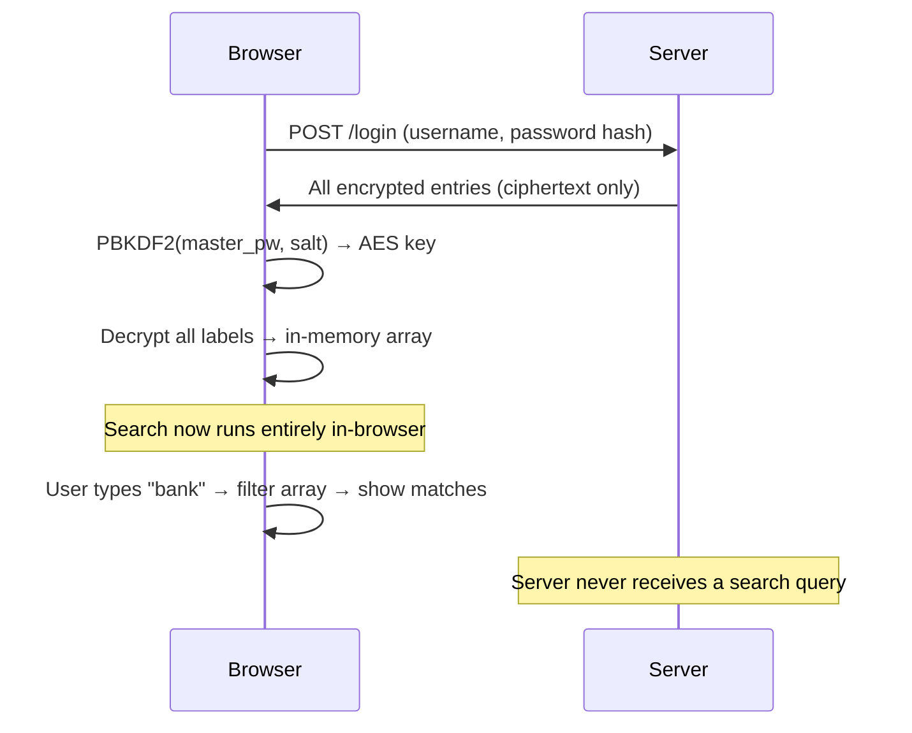
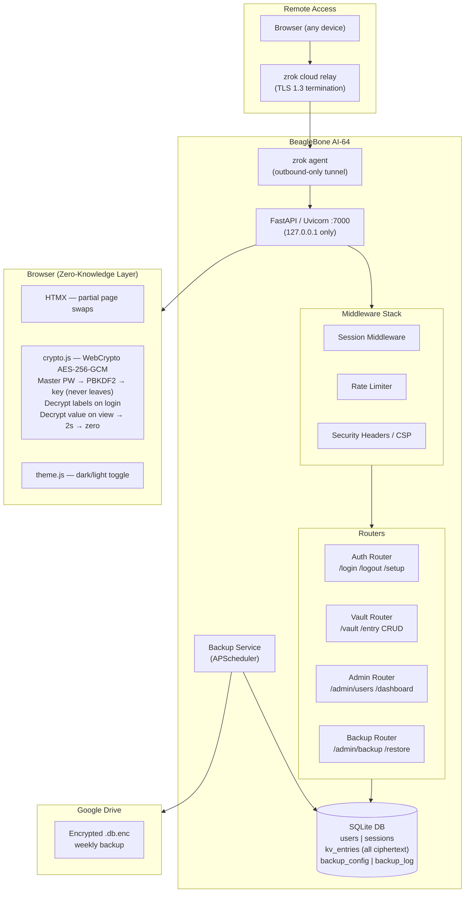
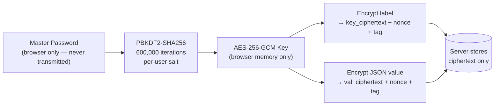
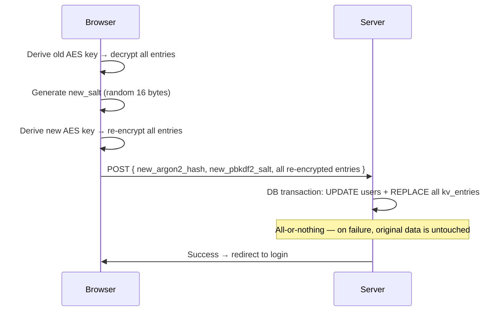
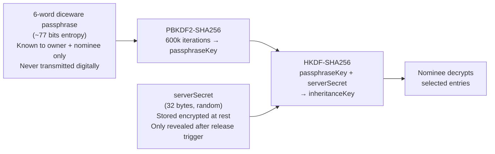
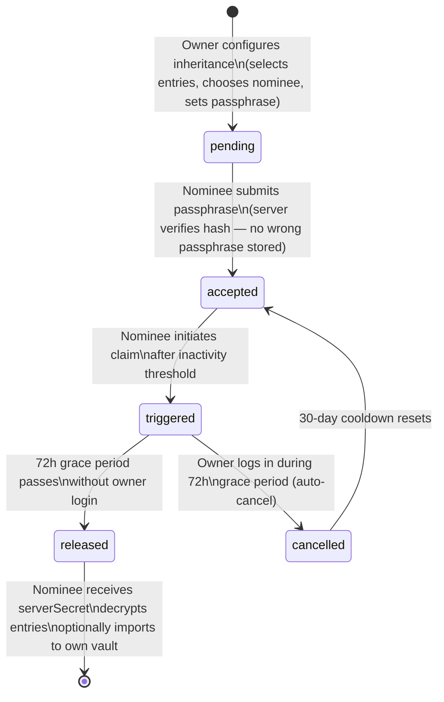
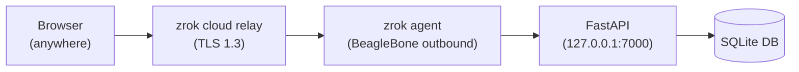

# NeeshSecrets — Silent Encrypted Credentials, Trusted Storage

### A self-hosted, zero-knowledge password manager built for a family that trusts the network but not the server.

> *"Can every secret my family stores be mathematically guaranteed never to touch the server in plaintext — even if the server is fully compromised?"*

NeeshSecrets answers yes. It's a family-scale credential vault I designed and deployed on a BeagleBone AI-64 home server. Both the label and content of every vault entry are AES-256-GCM encrypted in the browser before any data leaves the device. The server stores only ciphertext blobs. The server cannot decrypt anything it stores — not with full database access, not with application source code.

---

## What's Inside

| Section | |
|:--------|:--|
| [Product Vision](#product-vision) | Why this exists and what problem it solves |
| [What It Does](#what-it-does) | Vault, structured entries, client-side search |
| [How It Works](#how-it-works) | Architecture, data flow, stack |
| [Security Architecture](#security-architecture) | Zero-knowledge model, encryption pipeline, threat model |
| [Nominee Inheritance](#nominee-inheritance) | Two-key cryptographic gate for post-death vault handoff |
| [Technical Decisions](#technical-decisions) | Design choices and the reasoning behind each one |
| [Deployment](#deployment) | BeagleBone + zrok + systemd |

---

## Product Vision

Most password managers have the same fundamental trust problem: the server can decrypt your secrets. Even end-to-end encrypted offerings require trusting the vendor's key management and server-side code. For a family-scale deployment on hardware you own, that trust can be eliminated by design.

NeeshSecrets is built on a single constraint: **the server must be architecturally incapable of reading any stored secret**, without relying on policy, access controls, or vendor promises. That constraint drives every design decision in the system.

### Goals

| Goal | Target |
|:-----|:-------|
| **Zero-knowledge** | Server stores only ciphertext — no policy, just math |
| **Family-scale** | 2–6 users, private household, one Admin |
| **Operational independence** | No cloud dependency, no subscription, runs on $80 ARM hardware |
| **Search without compromise** | Instant in-browser search over encrypted labels — server never sees a query |
| **Estate planning** | Cryptographic inheritance handoff without server involvement |
| **Auditability** | Single-file SQLite DB — trivially inspected, backed up, and restored |

### Platform

Runs on any Python 3.11+ host:

- **BeagleBone AI-64** — the production target. Always-on home server.
- **Any Linux ARM/x86 box** — Raspberry Pi, Ubuntu, Debian. systemd service included.
- **Windows** — full dev support, tested on Windows 11.

The entire stack — web server, background scheduler, database — runs in **one Python process**. No Docker. No Redis. No PostgreSQL daemon. SQLite in WAL mode and a single Uvicorn worker.

---

## What It Does

### Vault Entries — Structured, Not Flat

Each vault entry has an encrypted label and an encrypted value. The value is a **flat JSON dictionary** — user-defined named fields, each a string. Users define their own field schema per entry.

```
Label:  [ gmail_work          ]          ← encrypted in browser

Fields:
  Field name       Field value
  [ username    ]  [ alice@example.com  ]
  [ password    ]  [ ••••••••           ]  ← masked until reveal
  [ recovery    ]  [ backup@gmail.com   ]
  [ note        ]  [ work account       ]
  [+ Add field  ]

  [ Save ]  [ Cancel ]
```

On Save, the entire fields object is serialized as a flat JSON dict and encrypted as one ciphertext blob. The server receives only ciphertext — no field names, no values.

### Client-Side Search

At login, the browser derives the AES key from the master password and decrypts all entry labels into a JavaScript array held in memory. Search filters this array locally — no server round-trip, no query ever leaves the browser.



### Entry View — 2-Second Reveal

Sensitive fields (any field named "password", "pin", "secret", "token", etc.) are masked by default. On click, the value is decrypted, shown for 2 seconds, then the DOM node is cleared and memory zeroed.

```
gmail_work                               [Edit] [Delete]
────────────────────────────────────────
username    alice@example.com            [Copy]
password    s3cr3t123                    [Copy]  ← shown 2s, then ••••••••
recovery    backup@gmail.com             [Copy]
note        work account                 [Copy]
```

---

## How It Works

### System Architecture



### Data Flow Summary

On login the server returns **all encrypted entries** for the user. The browser derives the AES key from the master password via PBKDF2 (600k iterations, per-user salt) and decrypts all entry labels into memory. The derived key and decrypted labels both live in browser RAM only — they never leave the browser and are cleared on logout or page close.

On view, the browser decrypts the selected entry's value from the ciphertext already in the DOM. After 2 seconds, the DOM is cleared and the source ArrayBuffer is zeroed with `Uint8Array.fill(0)`.

Neither key names nor values ever touch the server in plaintext.

### Stack

| Layer | Technology | Why |
|:------|:-----------|:----|
| **Backend** | FastAPI + Uvicorn | Async, modern Python, clean dependency injection |
| **Templates** | Jinja2 + HTMX | Server-rendered HTML with partial swaps — no SPA framework, no build step |
| **Styling** | TailwindCSS (standalone CLI) | Compiled on dev machine, committed — BeagleBone never runs a CSS build |
| **Database** | SQLite (WAL mode) | Single file, trivially backed up, zero administration |
| **Client Crypto** | Web Cryptography API | Browser-native, no third-party crypto library |
| **Scheduler** | APScheduler | Runs inside the FastAPI process — no Celery, no Redis |
| **Tunnel** | zrok (reserved share) | HTTPS without port forwarding or static IP |
| **Password Hashing** | Argon2id | Server-side login credential hashing |
| **Testing** | pytest + Playwright | Unit, integration, and E2E browser coverage |

---

## Security Architecture

### Zero-Knowledge Model

The zero-knowledge guarantee covers all user-created content — both labels and values:



What the server stores per entry: user ID, entry ID, `key_ciphertext`, `key_nonce`, `val_ciphertext`, `val_nonce`, timestamps. No plaintext of any kind. A full server compromise exposes only encrypted blobs.

### Encryption Pipeline Details

- **Key derivation**: PBKDF2-SHA256, 600,000 iterations. The iteration count aligns with NIST SP 800-132 guidance for PBKDF2-SHA256.
- **Separate nonces**: Key name and value use independent 12-byte random nonces. Nonce reuse with AES-GCM is catastrophic — the separation eliminates any such risk even when both fields derive from the same key.
- **`extractable: false`**: The AES key is created with `extractable: false`. It lives inside the browser's native crypto engine and cannot be read back into JavaScript — not by application code, not by extensions, not by DevTools.
- **ArrayBuffer zeroing**: Decrypted content returns as an `ArrayBuffer`. After decoding to string (unavoidable for DOM display), the source buffer is immediately zeroed with `Uint8Array.fill(0)`. The DOM node is cleared after 2 seconds. JavaScript string immutability means the GC-heap copy cannot be zeroed — this is documented as an accepted limitation of the runtime, not overstated as mitigated.

### Threat Model Coverage

| Threat | Coverage |
|:-------|:---------|
| Full server/DB compromise | Ciphertext only exposed — no plaintext, no labels |
| Network interception | TLS 1.3 via zrok; HSTS header on all responses |
| Username enumeration via preflight | HMAC-derived fake salt returned for unknown users — identical timing and format |
| Brute force login | Argon2id server-side + rate limits: 5 attempts / 15 min / IP, 10 / hour / username |
| XSS via HTMX fragments | Zero inline scripts in any HTMX fragment (CSP mandate); per-request nonce on the one permitted inline script |
| Browser extension injecting into password field | Shadow DOM wrapping master password input; randomized `name`/`id` on each page load; `MutationObserver` extension detection |
| Session hijacking | HttpOnly + Secure + SameSite=Strict cookie; 256-bit random session token; admin can invalidate all sessions instantly |
| Backup file offline attack | All backups AES-256-GCM encrypted with a separate `BACKUP_ENCRYPTION_PASSWORD` before write or upload |

### Password Change — Atomic Re-Encryption

Changing the master password requires re-encrypting every vault entry. This runs entirely in the browser in a single atomic server transaction:



---

## Nominee Inheritance

The most technically interesting feature. A vault owner can pre-authorize a family member (nominee) to access a selected subset of vault entries after a prolonged period of owner inactivity — with no ability for either the nominee alone or the server alone to decrypt early.

### The Two-Key Gate



Neither component alone is sufficient: the nominee needs the passphrase (out-of-band, never stored digitally) and the server secret (withheld until the release trigger fires).

### State Machine



### Security Properties

| Threat | Mitigation |
|:-------|:-----------|
| Server DB compromise | `serverSecret` encrypted with `AES-GCM(APP_SECRET_KEY)` at rest — attacker needs both DB dump and `.env` |
| Nominee acts prematurely | Server gate: inactivity threshold + 72h grace + 30-day cooldown between attempts |
| Owner alive but unaware | Any owner login during 72h grace auto-cancels the trigger |
| Wrong passphrase accepted | Server verifies `SHA-256(passphrase + verify_salt)` before acceptance — prevents silent silent silent silent silent silent silent failure discovered only after owner's death |
| Admin bypassing release | No admin override — release is time-based and automatic; admin has read-only visibility |
| Passphrase forgotten by nominee | Stored encrypted in nominee's own vault during acceptance flow |

### Import to Nominee Vault

After release, the nominee decrypts inheritance entries and can re-encrypt them under their own vault key — they appear in a dedicated "Inherited: [OwnerName]" category.

---

## Technical Decisions

### HTMX over a SPA Framework

The UI is a searchable list with a form. HTMX handles partial page swaps without a Node.js build pipeline, a separate API contract, or a JavaScript state management layer. Templates live on the server alongside access control logic — simpler security surface, no CORS, no token management in the client. TailwindCSS is compiled on the dev machine and committed; the BeagleBone never runs a CSS build step.

### Server-Side Sessions over JWT

JWTs cannot be revoked before expiry. Admin force-logout — needed when a user is removed or a device is lost — is impossible without a server-side revocation list, which is stateful anyway. Server-side sessions in SQLite give instant revocation: one `DELETE` row clears the session. At family scale the per-request DB read is negligible.

### SQLite over PostgreSQL

No separate service to manage. Single file — trivially backed up by copying one file. Backup encryption (AES-256-GCM) protects against offline dictionary attacks on the Argon2id hashes stored in that file. A full restore is: decrypt, replace file, restart. At family scale SQLite's single-writer model is never a bottleneck.

### Client-Side Search over FTS5

Server-side full-text search would require storing plaintext labels on the server, breaking the zero-knowledge model for labels. For a family vault (<500 entries) in-memory JS filtering is instantaneous — FTS5's indexing advantage is meaningless at this scale, and the security trade-off is unacceptable.

### PBKDF2 vs. Argon2id for Vault Key Derivation

Argon2id would provide stronger resistance to GPU attacks. PBKDF2-SHA256 at 600,000 iterations is adequate for this threat model: offline cracking requires access to a backup file (itself encrypted) or a server compromise (which yields only ciphertext). The password change protocol already handles full vault re-encryption, so upgrading the KDF in a future iteration requires only running that protocol with a new salt — the mechanism exists without a redesign.

### Service Account for Google Drive Backup

User OAuth tokens expire and require browser re-authorization — fragile for an unattended headless device. A service account authenticates server-to-server using a static JSON key file. Access is scoped to a single Drive folder (principle of least privilege). The JSON key is stored at filesystem mode 600; a full server compromise is required to obtain it, and it grants access only to that one backup folder.

---

## Deployment

### Target Hardware

| Attribute | Value |
|:----------|:------|
| Board | BeagleBone AI-64 |
| CPU | Dual-core Cortex-A72 (aarch64) |
| RAM | 4 GB |
| OS | Debian Bookworm (Linux ARM) |
| Python | 3.11 (system default) |

### Network — No Port Forwarding

zrok provides a reserved HTTPS URL that tunnels to `127.0.0.1:7000` on the BeagleBone via an outbound connection. No inbound ports are opened. No static IP. The stable URL persists across reboots.



LAN access (plain HTTP) is also supported for family members on the home network — acceptable for a trusted private subnet.

### Services

Two systemd units start at boot:

- **neeshsecrets.service** — `uvicorn app.main:app --host 127.0.0.1 --port 7000`, restart-on-failure
- **zrok.service** — `zrok share reserved {token} --headless`, restart-on-failure, after `network-online.target`

Deployment is handled by `deploy/update.sh`: 2-minute grace window for active users, then graceful stop → schema migration → restart. `deploy/migrate_db.py` applies numbered SQL files from `migrations/` in order.

### Backup Architecture

| Type | Frequency | Destination |
|:-----|:----------|:------------|
| Local | Daily (configurable) | `/backups/local/*.db.enc` |
| Google Drive | Weekly (configurable) | Encrypted upload via service account |

Both types use the same encryption format: `[16-byte salt][12-byte nonce][ciphertext][16-byte GCM tag]`. The backup encryption key is derived from a separate `BACKUP_ENCRYPTION_PASSWORD` config value — independent of all user passwords. Both can also be triggered manually from the Admin dashboard.

---

## Current Status

All core features are implemented and deployed:

- Zero-knowledge vault CRUD with structured JSON entries
- Client-side search over decrypted labels
- 2-second auto-hide with ArrayBuffer zeroing
- Admin dashboard: user management, system stats, backup configuration
- Local + Google Drive encrypted backup with restore flow
- Nominee inheritance with two-key cryptographic gate
- Account lockout, login audit logging, security headers (CSP, HSTS, X-Frame-Options)
- Full test suite: unit (pytest), integration (FastAPI TestClient), E2E (Playwright)

---

*Built with FastAPI, SQLite, HTMX, TailwindCSS, Web Cryptography API, and a firm belief that zero-knowledge should mean zero-knowledge.*
